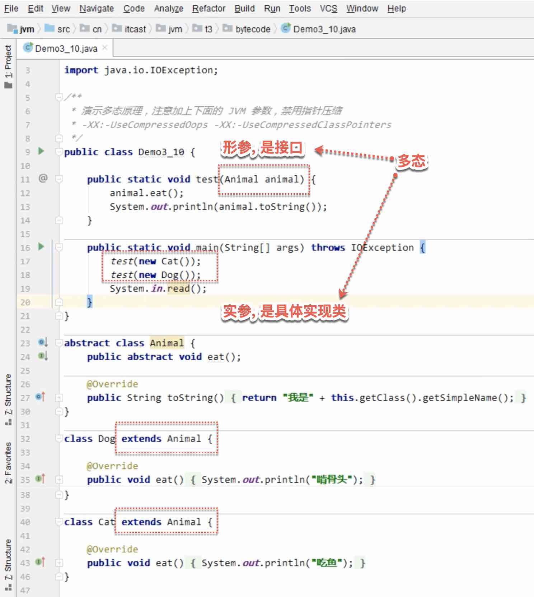

{: id="20210409013250-8f2afbz"}

# Java 多态
{: id="20210409013138-c8xaam4" updated="20210409013257"}

## Java是如何知道, 使用哪个实现类的?
{: id="20210409013250-xtkcj1u" updated="20210409013253"}

尽管形参是接口, 但是实参是具体的实现类, 所以根据形参, 就知道到底是使用哪个实现类.
{: id="20210409013204-2orlbx8" updated="20210409013239"}

{: id="20210409013200-a70o9bh" updated="20210409013201"}

# Java多态原理?
{: id="20210409013301-rbe3hrn" updated="20210409013309"}

多态原理, see ((20210409013414-en7k9qb "{{.text}}"))/((20210409021736-9wlhhkb "{{.text}}"))
{: id="20210409013309-xm62ujn" updated="20210409021757"}

{: id="20210409021800-oc34cvy"}

{: id="20210409013138-jdr1xxb" type="doc"}
