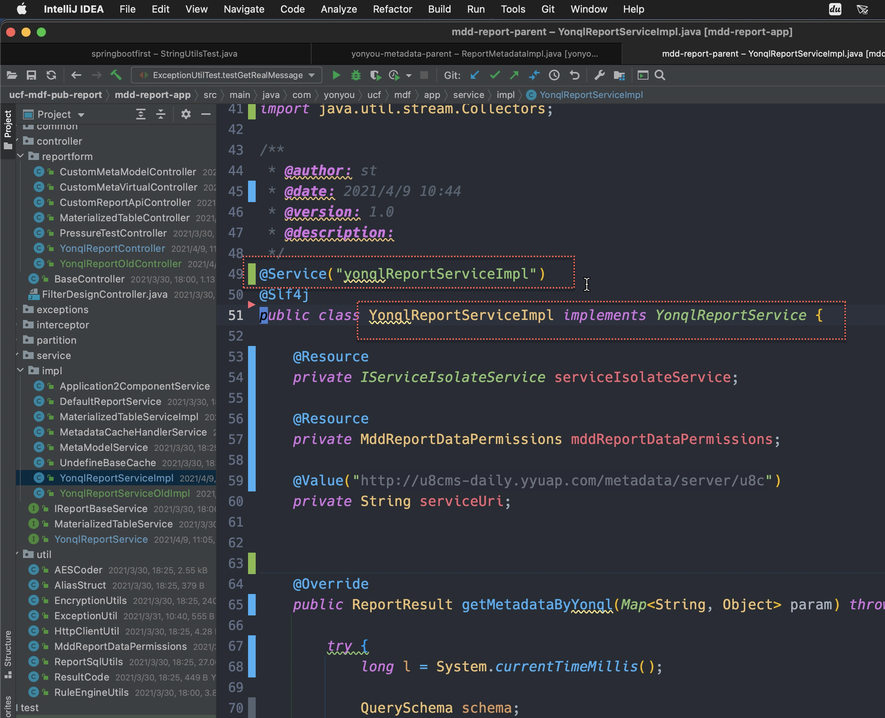

# Java 多态
{: id="20210409013138-c8xaam4" updated="20210409013257"}

# Java是如何知道, 使用哪个实现类的?
{: id="20210409013250-xtkcj1u" updated="20210410150339"}

## 方法调用中, 通过"形参, 实参"进行判断
{: id="20210410150346-hrt4858" updated="20210410150417"}

尽管形参是接口, 但是实参是具体的实现类, 所以根据形参, 就知道到底是使用哪个实现类.
{: id="20210409013204-2orlbx8" updated="20210409013239"}

{: id="20210409013200-a70o9bh" updated="20210409013201"}

## Spring注解中,通过指定bean name来判断
{: id="20210410150425-0431a33" updated="20210410150456"}

### 实现1
{: id="20210410150456-lj5pg2e" updated="20210410150511"}

{: id="20210410150511-9f99jxo" updated="20210410150522"}

### 实现2
{: id="20210410150529-6ncoy9u" updated="20210410150533"}

{: id="20210410150533-xcciwve" updated="20210410150539"}

### 通过指定的名字来判断, 到底使用哪个实现
{: id="20210410150540-pau34x5" updated="20210410150606"}

{: id="20210410150607-060w23z" updated="20210410150618"}

# Java多态原理?
{: id="20210409013301-rbe3hrn" updated="20210410150425"}

多态原理, see ((20210409013414-en7k9qb "{{.text}}"))/((20210409021736-9wlhhkb "{{.text}}"))
{: id="20210409013309-xm62ujn" updated="20210409021757"}

{: id="20210409021800-oc34cvy"}

{: id="20210409013138-jdr1xxb" type="doc"}
