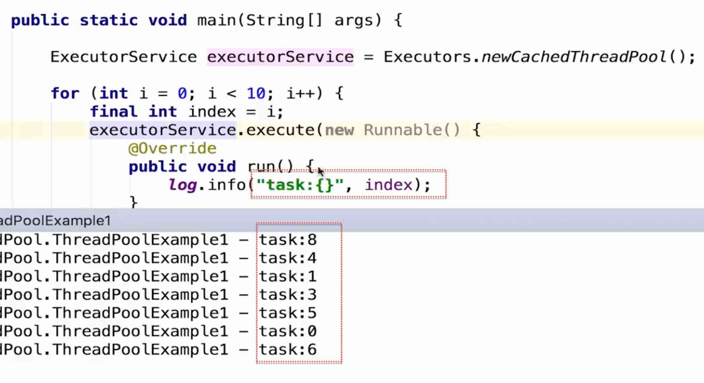

# See
{: id="20210410150001-nxbeh05" updated="20210410150004"}

https://docs.oracle.com/javase/8/docs/api/index.html
{: id="20210410145809-1chkegx"}

或者, 直接在idea中查看Formatter源码, 可以查看相关代码、注释、用法
{: id="20210410145809-cnatcq4"}

# String.format
{: id="20210410145809-vilki4g"}

## 方式一
{: id="20210410145809-lhyrrx8"}

```
static String str = "%s和%s的%s.一刻也不能%s,无论%s走到那里,都留下一首赞歌";

    public static void main(String[] args) {

        String format = String.format(str, "我", "我", "祖国", "分隔", "我","啦啦啦的马蒂");
        System.out.println(format);
        //输出结果：我和我的祖国.一刻也不能分隔,无论我走到那里,都留下一首赞歌

    }
```
{: id="20210410145809-ud8fax2"}

---
{: id="20210410145809-sonjmlc"}

```
String domain = "www.baidu.com";  
int iVisit = 0;  
System.out.println(String.format("该域名%s被访问了%s次.", domain , iVisit));

// 该域名www.baidu.com被访问0次
```
{: id="20210410145809-7g2up1m"}

# MessageFormat
{: id="20210410145809-hmfiymt"}

```
import java.text.MessageFormat;
static String str = "{0}和{0}的{1}.一刻也不能{2},无论{0}走到那里,都留下一首赞歌";

    public static void main(String[] args) {

        String format = MessageFormat.format(str, "我", "祖国", "分隔", "啦啦啦啦的马蒂");
        System.out.println(format);
        //输出：我和我的祖国.一刻也不能分隔,无论我走到那里,都留下一首赞歌
    }
```
{: id="20210410145809-v9hwxe8"}

# printf格式化日期
{: id="20210410145809-gi8lmrp"}

```
import java.util.*;

public class DateDemo {
   public static void main(String args[]) {
       Date date=new Date();                            
        //b的使用，月份简称  
        String str=String.format(Locale.US,"英文月份简称：%tb",date);  
        System.out.println(str);   
        System.out.printf("本地月份简称：%tb%n",date);  
        //B的使用，月份全称  
        str=String.format(Locale.US,"英文月份全称：%tB",date);  
        System.out.println(str);  
        System.out.printf("本地月份全称：%tB%n",date);  
        //a的使用，星期简称  
        str=String.format(Locale.US,"英文星期的简称：%ta",date);  
        System.out.println(str);  
        //A的使用，星期全称  
        System.out.printf("本地星期的简称：%tA%n",date);  
        //C的使用，年前两位  
        System.out.printf("年的前两位数字（不足两位前面补0）：%tC%n",date);  
        //y的使用，年后两位  
        System.out.printf("年的后两位数字（不足两位前面补0）：%ty%n",date);  
        //j的使用，一年的天数  
        System.out.printf("一年中的天数（即年的第几天）：%tj%n",date);  
        //m的使用，月份  
        System.out.printf("两位数字的月份（不足两位前面补0）：%tm%n",date);  
        //d的使用，日（二位，不够补零）  
        System.out.printf("两位数字的日（不足两位前面补0）：%td%n",date);  
        //e的使用，日（一位不补零）  
        System.out.printf("月份的日（前面不补0）：%te",date);  
   }
}
```
{: id="20210410145809-a7w9h6u"}

# log4j, 日志
{: id="20210410145809-ikm9cty"}

## Example
{: id="20210410145809-w5tfwpa"}


{: id="20210410145835-e7aapwr" updated="20210410145844"}

## 说明
{: id="20210410145809-p688c0l"}

使用slf4j日志组件打印变量时，建议使用”{}”占位符风格(C风格)，而不是”+”拼接符(C++风格)。例如：
{: id="20210410145809-kzdcc8a"}

```
logger.error("Country: {}, Province: {}, City: {}", ctry, prov, city); //占位符
logger.error("Country: "+ctry+", Province:" +prov +", City: "+city);   //拼接符=
```
{: id="20210410145809-8yulpqs"}

```
显然，占位符风格更直观，而且不容易出现笔误——上面的拼接符语句有问题，谁能发现？

但最常见的变量打印问题，是打印时未使用占位符或拼接符：
```
{: id="20210410145809-mnn0ka4"}

```
logger.error("print cannotBePrinted: ", cannotBePrinted);  //Wrong
logger.error("print canBePrinted: " + canBePrinted);  //Good
logger.error("print canBePrinted: {}", canBePrinted); //Better
```
{: id="20210410145809-u9b3o94"}

# Java字符串拼接的其他方式
{: id="20210410145809-yxazjus"}

1、 + 方式
{: id="20210410145809-u313uno"}

String str1="hello";
{: id="20210410145809-rpdp0qx"}

String str2="world";
{: id="20210410145809-2zca05h"}

String str=str1+str2;
{: id="20210410145809-0vc3mwi"}

1. {: id="20210410145809-tlkylh8"}concat方式
   {: id="20210410145809-geea4jz"}
{: id="20210410145809-h19o2gf"}

当两个量都为String类型且值不为null时，可以用concat方式
{: id="20210410145809-0ywe1e5"}

String a="a";
{: id="20210410145809-ldpcjmt"}

String b="b";
{: id="20210410145809-xa4vmns"}

String c= a.concat(b);
{: id="20210410145809-mj5pp14"}

理论上，此时拼接效率应该最高，因为已经假定两个量都为字符串，做底层优化不需要额外判断或转换，而其他方式无论如何优化，都要先走到这一步。
{: id="20210410145809-umnw0w1"}

2. {: id="20210410145809-wpw3aeu"}append方式
   {: id="20210410145809-oaj6xhq"}
{: id="20210410145809-ezs3ruu"}

当需要拼接至少三个量的时候，可以考虑使用StringBuffer#append()以避免临时字符串的产生
{: id="20210410145809-s0ui7ow"}

StringBuffer buf=new StringBuffer()
{: id="20210410145809-2n1tlnu"}

buf.append("a");
{: id="20210410145809-xh0fwe9"}

if(someCondition){
{: id="20210410145809-c5p17k3"}

buf.append("b");
{: id="20210410145809-yseoqbv"}

}
{: id="20210410145809-6cpri5x"}

buf.append("c");
{: id="20210410145809-alxruqu"}

String d=buf.toString();
{: id="20210410145809-yaeznbw"}

当a,b,c拼接起来会很长时，可以给在构造器中传入一个合适的预估容量以减少因扩展缓冲空间而带来的性能开销。
{: id="20210410145809-0cl42vk"}

StringBuffer buf=new StringBuffer(a.length()+b.length()+c.length());
{: id="20210410145810-v80ckx1"}

JDK对外提供的一些涉及可append CharSequence的参数或返回值类型往往是StringBuffer类型，毕竟安全第一，而StringBuffer大多数情况(包括append操作)线程安全。
{: id="20210410145810-y38gxvs"}

若不会出现多线程同时对一实例并发进行append操作，建议使用非线程安全的StringBuilder以获得更好性能
{: id="20210410145810-wba31fy"}

3. {: id="20210410145809-4g06mhl"}其他
   {: id="20210410145810-m495e9w"}
{: id="20210410145810-yxt9hhe"}

若需拼接至少三个量，只用一个连续拼接的语句就可完成时，从使代码简洁角度考虑，用plus方式。
{: id="20210410145810-qb9bs92"}

String a="a";
{: id="20210410145810-6qklhws"}

String b="b";
{: id="20210410145810-9c0upkc"}

String c="c";
{: id="20210410145810-m4wl51y"}

String d=a+b+c;
{: id="20210410145810-eiti95y"}

此时，第4句经JDK编译后其字节码(或)会自动优化为等效于下列代码编译后的字节码。
{: id="20210410145810-a88uswb"}

String d=new StringBuilder().append(a).append(b).append(c).toString();
{: id="20210410145810-l6ueoeb"}

若采用模板+参数来替换占位符的方式或需同时对要拼接日期/数字进行格式化，可以用String.format()来实现。
{: id="20210410145810-0pap53c"}

看完这篇文章，你们学会用Java拼接字符串了吗？如果还想学到更多技能或想了解更多相关内容，欢迎关注亿速云行业资讯频道，感谢各位的阅读！
{: id="20210410145810-unzotr6"}

{: id="20210410145810-u4ehi3q" updated="20210410162617"}

{: id="20210410145810-u9c9v86"}


{: id="20210410145808-hqimr3z" type="doc"}
