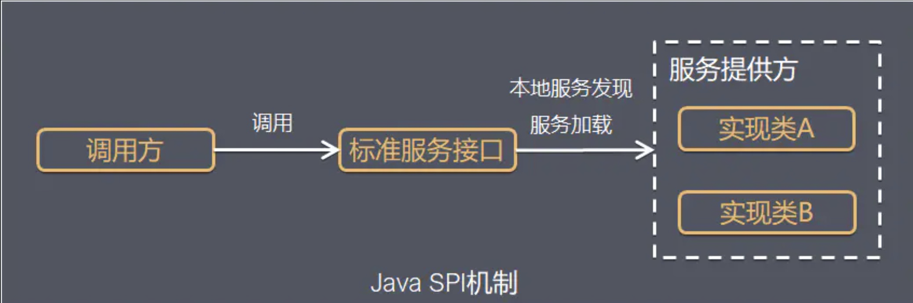

Java Service Provider Interface 和类加载机制有些关系. see ((20210411194707-3hvayan "{{.text}}"))
{: id="20210412092634-ip8544x" updated="20210412095834"}

# 简介
{: id="20210412092708-hm0lym4" updated="20210412095728"}

SPI全称Service Provider Interface，是Java提供的一套用来被第三方实现或者扩展的API，它可以用来启用框架扩展和替换组件。
{: id="20210412092801-pijtkvu"}

整体机制图如下
{: id="20210412092801-bvv2dj2"}


{: id="20210412092803-p3733l8" updated="20210412095725"}

Java SPI 实际上是“**基于接口的编程＋策略模式＋配置文件** ”组合实现的动态加载机制。
{: id="20210412095237-4sy28h6"}

系统设计的各个抽象，往往有很多不同的实现方案，在面向的对象的设计里，一般推荐模块之间基于接口编程，模块之间不对实现类进行硬编码。一旦代码里涉及具体的实现类，就违反了可拔插的原则，如果需要替换一种实现，就需要修改代码。为了实现在模块装配的时候能不在程序里动态指明，这就需要一种服务发现机制。
{: id="20210412095237-9njqeix"}

Java SPI就是提供这样的一个机制：为某个接口寻找服务实现的机制。有点类似IoC的思想，就是将装配的控制权移到程序之外，在模块化设计中这个机制尤其重要。所以SPI的核心思想就是**解耦** 。即, 将接口与具体的实现分离, 根据需要, 使用策略模式, 选择自己需要的实现类.
{: id="20210412095237-zi3fckc" updated="20210412095339"}

SPI [在 Wiki 上](https://en.wikipedia.org/wiki/Service_provider_interface) 就用了一句话就基本说清楚了它是干什么的。作用就是定义一些基础接口让第三方库去实现，之后依赖这些基础接口的程序能在发布之后甚至运行期间，通过引入不同的第三方库从而让服务表现出不同的行为。更简单的说就是实现通常说的 “插件” 的一种方式。Oracle 有专门介绍这个东西的文档，并举了 Audio Service 作为例子，在这里：[Introduction to the Service Provider Interfaces](https://docs.oracle.com/javase/tutorial/sound/SPI-intro.html)
{: id="20210412092708-tib6379" updated="20210412095214"}

# 应用场景
{: id="20210412092708-a3zu9e7" updated="20210412095535"}

概括地说，适用于：**调用者根据实际使用需要，启用、扩展、或者替换框架的实现策略**
{: id="20210412095421-hojtygq"}

比较常见的例子：
{: id="20210412095421-wsozwk8"}

* {: id="20210412095421-lhbzm1h"}数据库驱动加载接口实现类的加载
  {: id="20210412095421-a90rbvy"}

  JDBC加载不同类型数据库的驱动
  {: id="20210412095421-ij18lkt"}
* {: id="20210412095421-2e9kffi"}日志门面接口实现类加载
  {: id="20210412095421-110pn4f"}

  SLF4J加载不同提供商的日志实现类
  {: id="20210412095421-aeoxski"}
* {: id="20210412095421-bptvngo"}Spring
  {: id="20210412095421-ms7jm6g"}

  Spring中大量使用了SPI,比如：对servlet3.0规范对ServletContainerInitializer的实现、自动类型转换Type Conversion SPI(Converter SPI、Formatter SPI)等
  {: id="20210412095421-ioz1wl4"}
* {: id="20210412095421-iiwmtmc"}Dubbo
  {: id="20210412095421-hryfgt9"}

  Dubbo中也大量使用SPI的方式实现框架的扩展, 不过它对Java提供的原生SPI做了封装，允许用户扩展实现Filter接口
  {: id="20210412095421-9jrd74z" updated="20210412095721"}
{: id="20210412095421-byql307"}

# 使用介绍
{: id="20210412095456-2t1r9vl" updated="20210412095638"}

要使用Java SPI，需要遵循如下约定：
{: id="20210412095456-8ffezwe"}

* {: id="20210412095456-b6oewq2"}1、当服务提供者提供了接口的一种具体实现后，在jar包的META-INF/services目录下创建一个以“接口全限定名”为命名的文件，内容为实现类的全限定名；
  {: id="20210412095456-4jzhvx3"}
* {: id="20210412095456-sj4ysrb"}2、接口实现类所在的jar包放在主程序的classpath中；
  {: id="20210412095456-57uzena"}
* {: id="20210412095456-decuymk"}3、主程序通过java.util.ServiceLoder动态装载实现模块，**它通过扫描META-INF/services目**录下的配置文件找到实现类的全限定名，把类加载到JVM；
  {: id="20210412095456-yklsnbm" updated="20210412095629"}
* {: id="20210412095456-guf8mfl"}4、SPI的实现类必须携带一个不带参数的构造方法；
  {: id="20210412095456-od1d36e"}
{: id="20210412095456-l0v9nyk"}

{: id="20210412095555-o64z4wz" updated="20210412095557"}

比如, 在idea项目中, 全局搜索"meta-inf", 会出现很多结果, 比如:
{: id="20210412092329-jqh8d65" updated="20210412095606"}

```
META-INF/services/com.yonyou.cloud.hpapaas.yonql.query.func.ICommonQueryFieldParser

META-INF/spring-configuration-metadata.json

META-INF/services/com.yonyou.cloud.hpapaas.yonql.query.func.IFunctionParser

```
{: id="20210412092342-r68pv2h" updated="20210412092343"}


## 示例代码
{: id="20210412095456-036o714"}

**步骤1** 、定义一组接口 (假设是org.foo.demo.IShout)，并写出接口的一个或多个实现，(假设是org.foo.demo.animal.Dog、org.foo.demo.animal.Cat)。
{: id="20210412095456-b4mn4id"}

```java
public interface IShout {
    void shout();
}
public class Cat implements IShout {
    @Override
    public void shout() {
        System.out.println("miao miao");
    }
}
public class Dog implements IShout {
    @Override
    public void shout() {
        System.out.println("wang wang");
    }
}
```
{: id="20210412095456-a30grz6"}

**步骤2** 、在 src/main/resources/ 下建立 /META-INF/services 目录， 新增一个以接口命名的文件 (org.foo.demo.IShout文件)，内容是要应用的实现类（这里是org.foo.demo.animal.Dog和org.foo.demo.animal.Cat，每行一个类）。
{: id="20210412095456-et5tq14"}

文件位置
{: id="20210412095456-j94y4xt"}

```java
- src
    -main
        -resources
            - META-INF
                - services
                    - org.foo.demo.IShout
```
{: id="20210412095456-jxpqgjk"}

文件内容
{: id="20210412095456-r74j2u3"}

```java
org.foo.demo.animal.Dog
org.foo.demo.animal.Cat
```
{: id="20210412095456-ugyg1gl"}

**步骤3** 、使用 ServiceLoader 来加载配置文件中指定的实现。
{: id="20210412095456-0rfxsht"}

```java
public class SPIMain {
    public static void main(String[] args) {
        ServiceLoader<IShout> shouts = ServiceLoader.load(IShout.class);
        for (IShout s : shouts) {
            s.shout();
        }
    }
}
```
{: id="20210412095456-klgloc7"}

代码输出：
{: id="20210412095456-ox2v9ms"}

```java
wang wang
miao miao
```
{: id="20210412095456-m2ltpue"}

# 原理解析
{: id="20210412095456-s5jvk5n" updated="20210412095642"}

首先看ServiceLoader类的签名类的成员变量：
{: id="20210412095456-ewbg3tb"}

```java
public final class ServiceLoader<S> implements Iterable<S>{
private static final String PREFIX = "META-INF/services/";

    // 代表被加载的类或者接口
    private final Class<S> service;

    // 用于定位，加载和实例化providers的类加载器
    private final ClassLoader loader;

    // 创建ServiceLoader时采用的访问控制上下文
    private final AccessControlContext acc;

    // 缓存providers，按实例化的顺序排列
    private LinkedHashMap<String,S> providers = new LinkedHashMap<>();

    // 懒查找迭代器
    private LazyIterator lookupIterator;
  
    ......
}
```
{: id="20210412095456-wcmopko"}

参考具体ServiceLoader具体源码，代码量不多，加上注释一共587行，梳理了一下，实现的流程如下：
{: id="20210412095456-yfskgxq"}

* {: id="20210412095456-830vtqp"}1 应用程序调用ServiceLoader.load方法
  {: id="20210412095456-g9nonh9"}

  ServiceLoader.load方法内先创建一个新的ServiceLoader，并实例化该类中的成员变量，包括：
  {: id="20210412095456-ysfcr7x"}

  * {: id="20210412095456-h3uqb6l"}loader(ClassLoader类型，类加载器)
    {: id="20210412095456-p5q3ndg"}
  * {: id="20210412095456-xm243et"}acc(AccessControlContext类型，访问控制器)
    {: id="20210412095456-agk7vsi"}
  * {: id="20210412095456-p9xhlwx"}providers(LinkedHashMap<String,S>类型，用于缓存加载成功的类)
    {: id="20210412095456-url31ps"}
  * {: id="20210412095456-5kcgt4r"}lookupIterator(实现迭代器功能)
    {: id="20210412095456-66r9dio"}
  {: id="20210412095456-p03m9ys"}
* {: id="20210412095456-76gw8j2"}2 应用程序通过迭代器接口获取对象实例
  {: id="20210412095456-az3qgkg"}

  ServiceLoader先判断成员变量providers对象中(LinkedHashMap<String,S>类型)是否有缓存实例对象，如果有缓存，直接返回。
  {: id="20210412095456-25yb580"}

  如果没有缓存，执行类的装载，实现如下：
  {: id="20210412095456-wzl2vhk"}
* {: id="20210412095456-yiuf0uu"}(1) 读取META-INF/services/下的配置文件，获得所有能被实例化的类的名称，值得注意的是，ServiceLoader**可以跨越jar包获取META-INF下的配置文件** ，具体加载配置的实现代码如下：
  {: id="20210412095456-2y1f0m6"}
{: id="20210412095456-326c3zh"}

```dart
        try {
            String fullName = PREFIX + service.getName();
            if (loader == null)
                configs = ClassLoader.getSystemResources(fullName);
            else
                configs = loader.getResources(fullName);
        } catch (IOException x) {
            fail(service, "Error locating configuration files", x);
        }
```
{: id="20210412095456-ubzo271"}

* {: id="20210412095456-kff3zyy"}(2) 通过反射方法Class.forName()加载类对象，并用instance()方法将类实例化。
  {: id="20210412095456-9ybq7oe"}
* {: id="20210412095456-80b066c"}(3) 把实例化后的类缓存到providers对象中，(LinkedHashMap<String,S>类型）
  {: id="20210412095456-mgi1k6l"}

  然后返回实例对象。
  {: id="20210412095456-s0n2kjj"}
{: id="20210412095456-w86w4xm"}

# 总结
{: id="20210412095456-w1lxycn" updated="20210412095647"}

## 优点
{: id="20210412095456-2394tdu" updated="20210412095658"}

使用Java SPI机制的优势是实现解耦，使得第三方服务模块的装配控制的逻辑与调用者的业务代码分离，而不是耦合在一起。应用程序可以根据实际业务情况启用框架扩展或替换框架组件。
{: id="20210412095456-krqyzi0"}

相比使用提供接口jar包，供第三方服务模块实现接口的方式，SPI的方式使得源框架，不必关心接口的实现类的路径，可以不用通过下面的方式获取接口实现类：
{: id="20210412095456-wbw4lkv"}

* {: id="20210412095456-g8rwig5"}代码硬编码import 导入实现类
  {: id="20210412095456-mk2et0g"}
* {: id="20210412095456-vgztbew"}指定类全路径反射获取：例如在JDBC4.0之前，JDBC中获取数据库驱动类需要通过**Class.forName("com.mysql.jdbc.Driver")** ，类似语句先动态加载数据库相关的驱动，然后再进行获取连接等的操作
  {: id="20210412095456-1hk28a0"}
* {: id="20210412095456-2d7yjgt"}第三方服务模块把接口实现类实例注册到指定地方，源框架从该处访问实例
  {: id="20210412095456-qc84uc6"}
{: id="20210412095456-9wb4q7c"}

通过SPI的方式，第三方服务模块实现接口后，在第三方的项目代码的META-INF/services目录下的配置文件指定实现类的全路径名，源码框架即可找到实现类
{: id="20210412095456-8p6tg2j"}

## 缺点
{: id="20210412095456-hilbo2b" updated="20210412095705"}

* {: id="20210412095456-qct1jgh"}虽然ServiceLoader也算是使用的延迟加载，但是基本只能通过遍历全部获取，也就是接口的实现类全部加载并实例化一遍。如果你并不想用某些实现类，它也被加载并实例化了，这就造成了浪费。获取某个实现类的方式不够灵活，只能通过Iterator形式获取，不能根据某个参数来获取对应的实现类。
  {: id="20210412095456-0uzzu88"}
* {: id="20210412095456-evdzivw"}多个并发多线程使用ServiceLoader类的实例是不安全的。
  {: id="20210412095456-u2zwwx8"}
{: id="20210412095456-cvmvs8y"}

# 参考
{: id="20210412095456-xjqndvh"}

[Java核心技术36讲](https://links.jianshu.com/go?to=https%3A%2F%2Ftime.geekbang.org%2Fcolumn%2Fintro%2F82%3Fcode%3Dw8EZ6RGOQApZJ5tpAzP8dRzeVHxZ4q%252FfOdSbSZzbkhc%253D)
{: id="20210412095456-klg874c"}

[The Java™ Tutorials](https://links.jianshu.com/go?to=https%3A%2F%2Fdocs.oracle.com%2Fjavase%2Ftutorial%2Fext%2Fbasics%2Fspi.html)
{: id="20210412095456-sjqzl4z"}

[Java Doc](https://links.jianshu.com/go?to=https%3A%2F%2Fdocs.oracle.com%2Fjavase%2F8%2Fdocs%2Fapi%2Fjava%2Futil%2FServiceLoader.html)
{: id="20210412095456-lrvgz9c"}

[Service Provider Interface: Creating Extensible Java Applications](https://links.jianshu.com/go?to=https%3A%2F%2Fwww.developer.com%2Fjava%2Farticle.php%2F3848881%2FService-Provider-Interface-Creating-Extensible-Java-Applications.htm)
{: id="20210412095456-hgu3dfd"}

[Service provider interface](https://links.jianshu.com/go?to=https%3A%2F%2Fen.wikipedia.org%2Fwiki%2FService_provider_interface)
{: id="20210412095456-5s8da3f"}

[Java ServiceLoader使用和解析](https://links.jianshu.com/go?to=https%3A%2F%2Fwww.cnblogs.com%2Flovesqcc%2Fp%2F5229353.html)
{: id="20210412095456-q87c7is"}

[Java基础之SPI机制](https://links.jianshu.com/go?to=https%3A%2F%2Fblog.csdn.net%2Fyangguosb%2Farticle%2Fdetails%2F78772730)
{: id="20210412095456-vplrdj3"}

[Java中SPI机制深入及源码解析](https://links.jianshu.com/go?to=https%3A%2F%2Fcxis.me%2F2017%2F04%2F17%2FJava%25E4%25B8%25ADSPI%25E6%259C%25BA%25E5%2588%25B6%25E6%25B7%25B1%25E5%2585%25A5%25E5%258F%258A%25E6%25BA%2590%25E7%25A0%2581%25E8%25A7%25A3%25E6%259E%2590%2F)
{: id="20210412095456-ju4869j"}

[SPI机制简介](https://links.jianshu.com/go?to=http%3A%2F%2Fwww.spring4all.com%2Farticle%2F260)
{: id="20210412095456-xj247t2"}

{: id="20210412095456-6zu6cc1" updated="20210412095526"}

{: id="20210412095520-uz228ea"}


{: id="20210412092329-jnx35so" type="doc"}
