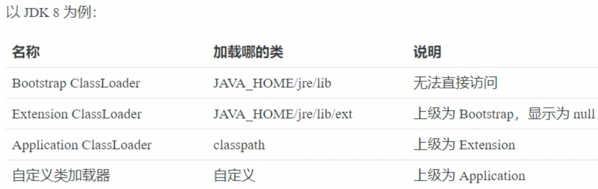
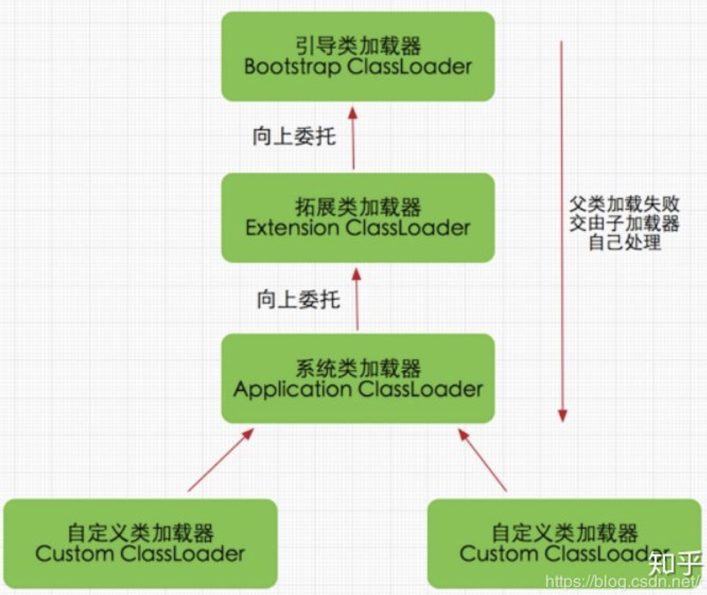
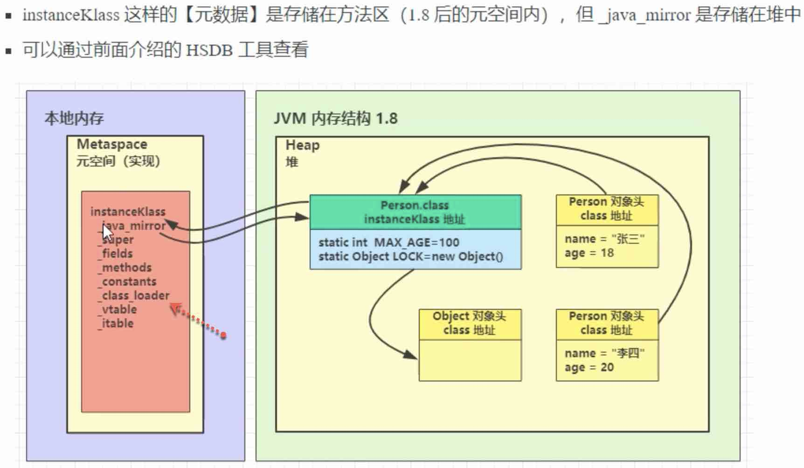
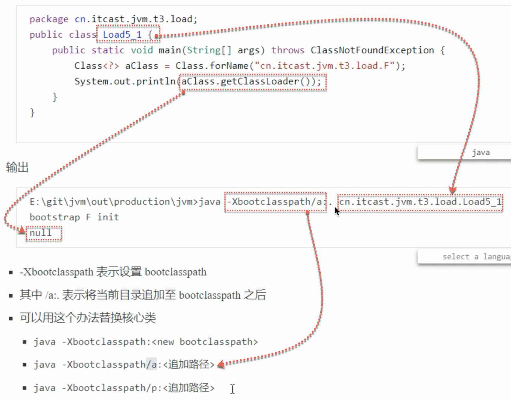
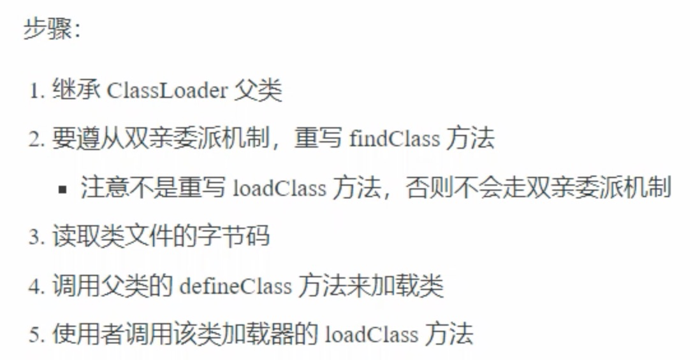

# 类加载器-类型
{: id="20210411194707-9wvz97d" updated="20210412020504"}

see ((20210409013414-en7k9qb "{{.text}}")) / ((20210409021736-hqclkfv "{{.text}}"))
{: id="20210411194734-tfvsfpo" updated="20210411194757"}

## 类加载器的类型
{: id="20210412021143-zyjuxge" updated="20210412021154"}


{: id="20210411194731-6yxirae" updated="20210411194733"}


{: id="20210412031640-quxryb0" updated="20210412031701"}

{: id="20210411195408-3fx521c"}

- {: id="20210411204523-dystbuh"}classpath, see ((20210411195419-kdb9xri "{{.text}}"))
  {: id="20210411204523-acl1m7y" updated="20210411204526"}
- {: id="20210411204526-zyv0y65"}不同类型的类, see ((20210411201036-nk3yx38 "{{.text}}"))
  {: id="20210411204526-gnq2nqx" updated="20210411204548"}
{: id="20210411194743-o8mqoe6" updated="20210411204523"}

## 什么是((20210412020916-yh4n3ri "{{.text}}")) ?
{: id="20210412020820-zj53z9h" updated="20210412020922"}

((20210412020916-yh4n3ri "{{.text}}"))是((20210412021143-zyjuxge "{{.text}}")) 之一.
{: id="20210412020922-z6nytrw" updated="20210412021217"}

加载程序自定义的类, 也就是在((20210411195419-kdb9xri "{{.text}}")) 中指定的某些jar, 比如maven依赖的一些库等((20210412003115-4idwdz6 "{{.text}}"))
{: id="20210412021109-biw7xw4" updated="20210412021109"}

# 如何获取当前类的classloader?
{: id="20210411204553-n0frmii" updated="20210412014923"}

如何获取当前类的classloader?
{: id="20210412014908-xuz1bmu" updated="20210412014918"}

```
@Slf4j
public class StringUtilsTest {


    public static void main(String[] args) {
//        m1();
//        m2_while();
        ClassLoader classLoader = new String().getClass().getClassLoader();
        log.info("the classLoader is:{}",classLoader);

        ClassLoader classLoader_2 = new StringUtilsTest().getClass().getClassLoader();
        log.info("the classLoader is:{}",classLoader_2);
    }
```
{: id="20210412014554-uldgour" updated="20210412014555"}

result
{: id="20210412014603-5xwlr4u" updated="20210412014606"}

下面的null, 实际上,就是Bootstrap ClassLoader
{: id="20210412014622-h71ocsb" updated="20210412014713"}

```
the classLoader is:null
the classLoader is:sun.misc.Launcher$AppClassLoader@18b4aac2

```
{: id="20210412014606-5gsqb2i" updated="20210412014607"}

# class为什么能获取到classloadeer?
{: id="20210412014802-2022nfc" updated="20210412032323"}

为什么通过类的实例(see ((20210412032031-zufa8ur "{{.text}}")) ), 能获取到classloadeer?
{: id="20210412014830-jecs85o" updated="20210412032454"}

要想使用class文件, 则必须要用classloader加载该class文件. 而该class文件中, 就标记了其"classloader"是谁, 所以, 能获取当前类的classloader. see details ((20210411204553-n0frmii "{{.text}}"))
{: id="20210412014946-r8jgeub" updated="20210412015120"}

注意, 是"class"文件中, 标记了该class的classloader, 所以先要通过instance获取得到class(((20210412032031-zufa8ur "{{.text}}")) ), 然后再通过class获取到classloader. 就如同上面的获取过程((20210411204553-n0frmii "{{.text}}"))
{: id="20210412020552-mpnog91" updated="20210412032422"}

其中, jvm将class文件加载到方法区, 该class的元信息中会包含"classlaoder"关键字, see ((20210409013414-en7k9qb "{{.text}}")) / ((20210409021736-hnb8ygy "{{.text}}"))
{: id="20210412015132-ad0wla0" updated="20210412020433"}


{: id="20210412015122-n8cz7bj" updated="20210412020442"}

# 如何指定具体的类加载器?
{: id="20210412022027-h1rwyrb" updated="20210412022043"}

命令行运行某Java类时, 如何指定:
{: id="20210412022044-uvy5165" updated="20210412022124"}

用哪个类加器来加载该class文件? 或
{: id="20210412023628-f8qd1w7" updated="20210412023644"}

该class由哪个加载器来加载?
{: id="20210412023644-atlbclg" updated="20210412023653"}

{: id="20210412023654-c6q0mub"}

see ((20210409013414-en7k9qb "{{.text}}")) / ((20210409021736-xwyej3u "{{.text}}"))
{: id="20210412022128-blg4ptt" updated="20210412022150"}


{: id="20210412022124-j36jazp" updated="20210412022126"}

# 双亲委派模式
{: id="20210412020511-gnugyo2" updated="20210412022027"}

see ((20210409013414-en7k9qb "{{.text}}")) / ((20210409021736-0s48eyw "{{.text}}"))
{: id="20210412021320-5g840m5" updated="20210412032003"}

# (SPI) 和类加载机制 #@todo#
{: id="20210412031836-xsf02tj" updated="20210412031925"}

[Java Service Provider Interface (SPI) 和类加载机制# ](https://ylgrgyq.com/spi-and-class-loading.html) 自定义类加载器?
{: id="20210412023701-rzlshgy" updated="20210412032001"}

## 为什么要自定义类加载器?
{: id="20210412025626-f7000xt" updated="20210412025646"}

see ((20210409013414-en7k9qb "{{.text}}")) /((20210409021736-vvic0u1 "{{.text}}"))
{: id="20210412025646-2gg8z9f" updated="20210412032005"}

{: id="20210412032006-mgqrw6j" updated="20210412032006"}

自定义类加载器的核心在于对字节码文件的获取，如果是加密的字节码则需要在该类中对文件进行解密。
{: id="20210412025659-oskh3hi"}

因为实际项目中，会有多种加载.class文件的方式，及不同目的:
{: id="20210412025659-yj2br82" updated="20210412030412"}

* {: id="20210412025659-18zm6u8"}想加载非((20210411195419-kdb9xri "{{.text}}")) 任意路径中的class. 即, 当某class文件不在((20210411195419-kdb9xri "{{.text}}")) 中, 可以通过自定义的类加载器进行加载.
  {: id="20210412025659-lmd68us" updated="20210412030107"}
* {: id="20210412030126-9543uk1"}某class, 包相同, 名字也相同, 只是不同版本, 希望能同时加载这些class而不起冲突, 对这些class进行隔离. 常见与((20210412011909-tui4ioh "{{.text}}"))
  {: id="20210412030126-8uukqjc" updated="20210412030259"}
* {: id="20210412095859-4dodj4l"}((20210412092329-jnx35so "{{.text}}"))
  {: id="20210412095859-raxzexi" updated="20210412095906"}
* {: id="20210412030307-6kd9fu2"}通过接口来使用实现, 希望解耦. 常见于框架设计.
  {: id="20210412030307-warzkkj" updated="20210412030353"}
* {: id="20210412025659-mprvtpo"}通过网络下载.class文件. see [自定义网络类加载器](https://blog.csdn.net/Leon_Jinhai_Sun/article/details/106445613)
  {: id="20210412025659-tf9msot" updated="20210412030914"}
* {: id="20210412025659-ermw2qx"}从zip，jar等归档文件中加载.class文件
  {: id="20210412025659-tvn34lc"}
* {: id="20210412025659-ui8ho2g"}从专有数据库中提取.class文件
  {: id="20210412025659-t27ii57"}
* {: id="20210412025659-wla11o1"}将Java源文件动态编译为.class文件
  {: id="20210412025659-4pkx0g6"}
{: id="20210412025659-ptkum4l"}

## 如何自定义类加载器?
{: id="20210412025707-4wpcg8k" updated="20210412025719"}

see ((20210409013414-en7k9qb "{{.text}}")) /((20210409021736-vvic0u1 "{{.text}}"))
{: id="20210412030428-vugu0mk"}


{: id="20210412025719-7nrp2ai" updated="20210412030426"}

# 自定义类加载器-case-SpringBoot热加载 #@todo#
{: id="20210412023726-stzme5w" updated="20210412031418"}

[Java 类加载器（ClassLoader）的实际使用场景有哪些？](https://www.zhihu.com/question/46719811)
{: id="20210412031331-64pi2rx"}

# [JVM类加载器能否加载自定义的String？](https://my.oschina.net/u/4477286/blog/4253842) #@todo# | #面试题#
{: id="20210412021343-3zoc6gv" updated="20210412030810"}

不能. 另外, 自定义类加载器也是无法实现加载java.lang.String的
{: id="20210412030728-fxfkrop" updated="20210412030739"}

{: id="20210412030740-aapmren"}


{: id="20210411194707-3hvayan" type="doc"}
