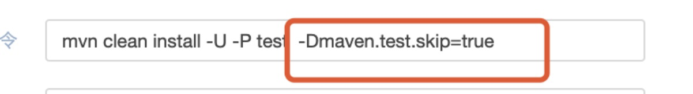
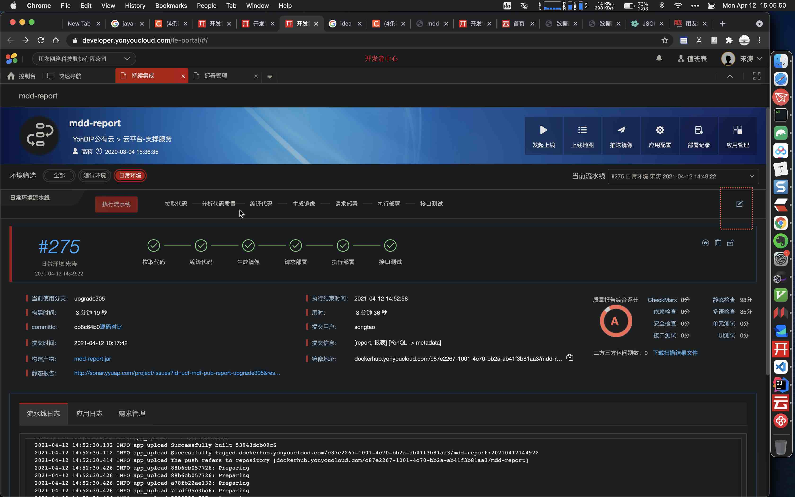
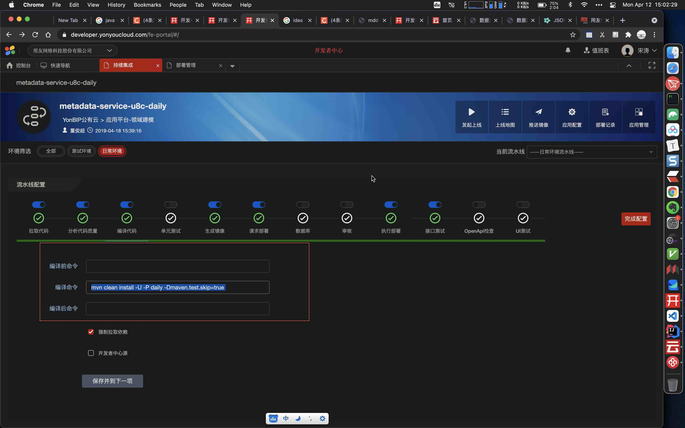

#yonyon#
{: id="20210412145022-d2nzluw" updated="20210412145028"}

maven跳过测试,如何操作?
{: id="20210412145032-4zj2f1e" updated="20210412145046"}


{: id="20210412145008-tzs5942" updated="20210412145010"}

```
mvn clean install -U -P daily -Dmaven.test.skip=true 


# 未跳过测试
mvn clean install -U -P combine

```
{: id="20210412150219-rdyn4ys" updated="20210412150220"}

{: id="20210412150254-be7nswx"}

在哪里配置?
{: id="20210412150254-qqnitlv" updated="20210412150301"}


{: id="20210412150303-5vn9of1" updated="20210412150604"}

设置, 跳过测试
{: id="20210412150608-odk37xh" updated="20210412150612"}


{: id="20210412150301-gfvwslx" updated="20210412150302"}

{: id="20210412145011-auyjcc5"}


{: id="20210412145007-o3uq6nc" type="doc"}
