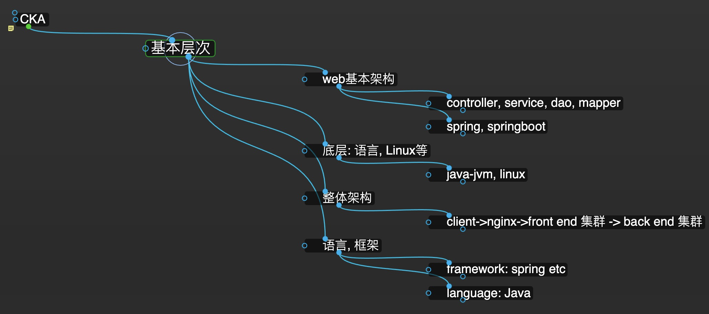

# cka知识架构
{: id="20210410103831-owrw8d3" updated="20210410103846"}

{: id="20210410103847-hif4tys"}

# 层次概述
{: id="20210410103847-76rufye" updated="20210410104202"}

{: id="20210410104202-9kugl9y" updated="20210410105147"}

# 基本架构
{: id="20210410104203-zbtehfm" updated="20210410104211"}

{: id="20210410104211-v6foob7"}

# Web基本架构
{: id="20210410104211-t32cxd7" updated="20210410104221"}

{: id="20210410104222-zaxurzh"}

# 语言, 框架
{: id="20210410104221-j9bi6vr" updated="20210410104241"}

{: id="20210410104241-w86pok1"}

# 底层
{: id="20210410104241-rtti4uk" updated="20210410104246"}

{: id="20210410103852-wdfgzfo"}

{: id="20210410103831-spy6wmi" type="doc"}
