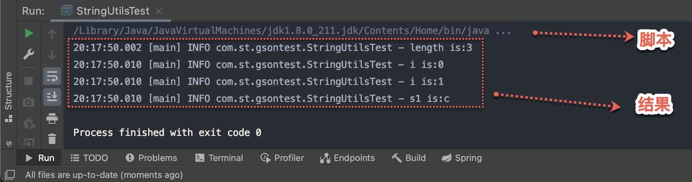

# 环境
{: id="20210412012756-fwnvwvr" updated="20210412013747"}

OS: macos
{: id="20210411203708-n67c9gs" updated="20210412012748"}

idea: 2020.3
{: id="20210411203710-9ewaj94" updated="20210412012748"}

# 示例图
{: id="20210411201036-1ipe9w7" updated="20210412012756"}

以下是idea通过`执行脚本`运行某个Java文件及其`结果`
{: id="20210411201914-mmzpwu6" updated="20210411203655"}


{: id="20210411201739-vsnmz3i" updated="20210411201913"}

将上图"脚本"部分, 展开后, 会有很长的内容, 具体分析如下.
{: id="20210411201725-5xdhuxg" updated="20210411202107"}

# 相关说明
{: id="20210411201724-fohlyks" updated="20210412012820"}

其中相关参数, 见相关参考
{: id="20210411203055-z8iwory" updated="20210411203152"}

- {: id="20210411203437-ihwx5va"}`-javaagent`, see ((20210411202846-za1kt3b "{{.text}}"))
  {: id="20210411203437-t4a8gg0"}
{: id="20210411203137-npcm2l8" updated="20210411203437"}

- {: id="20210412013030-anckdi3"}idea如何添加jar? 有以下三种方式,添加jar
  {: id="20210412013030-qr2bnne" updated="20210412013235"}
- {: id="20210412013041-gx3x8al"}
  - {: id="20210412013053-64ffl9n"}指定JDK. project, module会指定JDK及其版本
    {: id="20210412013053-tduoto2" updated="20210412013131"}
  - {: id="20210412013137-t7ylqe0"}手动添加jar到项目中
    {: id="20210412013137-boesv2m" updated="20210412013145"}
  - {: id="20210412013145-jmknt6i"}自动添加maven, gradle等依赖see ((20210412003115-4idwdz6 "{{.text}}"))
    {: id="20210412013145-kmsn79h" updated="20210412013609"}
  {: id="20210412013041-7vb5zdx" updated="20210412013053"}
{: id="20210412013027-eiahgor" updated="20210412013030"}

- {: id="20210412012321-vnnioyd"}idea的这个脚本中, classpath中的jar, 都是从哪里来的?  idea会将上面"添加jar的方式" (((20210412013030-anckdi3 "{{.text}}")) ) 中涉及到的jar, 加入到classpath中. 所以, `--classpath` 参数后面, 会有很多的jar
  {: id="20210412012321-fsvyp2y" updated="20210412013546"}
- {: id="20210412013612-abdglib"}`-classpath`, see ((20210411195419-kdb9xri "{{.text}}")). 因为classpath中, 包含多种类型的jar, 而每种类型的jar, 是有不同类型的((20210411194707-3hvayan "{{.text}}"))加载的.
  {: id="20210412013612-3atr0qn" updated="20210412013615"}
{: id="20210411203132-4kpbep8" updated="20210412013439"}

- {: id="20210411203441-cp96s3a"}每种类型的jar是哪个类加载加载的? see ((20210411194707-3hvayan "{{.text}}"))
  {: id="20210411203441-96i22nk" updated="20210412012951"}
- {: id="20210412010630-0qyxlug"}idea如何设置参数? see((20210412010647-zkenhj5 "{{.text}}"))
  {: id="20210412010630-c3gngqo" updated="20210412013622"}
{: id="20210411203428-k52t0ay" updated="20210411203441"}

# 示例图-分析
{: id="20210412012824-f2amglc" updated="20210412012848"}


注意, 下面的脚本, 也就是上面的截图, **实际上, 就是一行**, 为了分析, 才换成多行的.
{: id="20210411203229-73bykye" updated="20210412010158"}

基本格式:
{: id="20210412010256-vqxpe65" updated="20210412010305"}

```
java -javaagent <..> -Dfile.encodeing=UTF-8 -classpath <...> -Xms1024M .. <java类>
```
{: id="20210412010328-3czyqm6" updated="20210412010329"}

- {: id="20210412013636-n9fvasd"}Java程序
  {: id="20210412013636-9s9lu3l" updated="20210412013647"}
- {: id="20210412013648-6gsb9tw"}代理
  {: id="20210412013648-yqmykd9" updated="20210412013651"}
- {: id="20210412013651-8t2o2w1"}编码格式
  {: id="20210412013651-7avt227" updated="20210412013658"}
- {: id="20210412013658-s8urqkh"}-classpath
  {: id="20210412013658-ubalhlv" updated="20210412013703"}
- {: id="20210412013704-t3ha0a2"}jvm参数
  {: id="20210412013704-splcjv0" updated="20210412013715"}
- {: id="20210412013734-8joq2zj"}Java类
  {: id="20210412013715-e0qmxq8" updated="20210412013723"}
- {: id="20210412013715-5zup7gr"}运行结果
  {: id="20210412013734-yzr86r4" updated="20210412013740"}
{: id="20210412013634-jio050r" updated="20210412013636"}

上面截图的具体内容, 及分析:
{: id="20210412010305-dw6mekk" updated="20210412013634"}

```java
// 使用java程序运行. 
// java程序的绝对路径
/Library/Java/JavaVirtualMachines/jdk1.8.0_211.jdk/Contents/Home/bin/java 

// 指定javaagent
-javaagent
:/Applications/IntelliJ IDEA.app/Contents/lib/idea_rt.jar=62878
:/Applications/IntelliJ IDEA.app/Contents/bin 

// 指定文件的编码集
-Dfile.encoding=UTF-8 

// 指定classpath
// 涉及多个jar, 每种类型的jar, 有对应的类加载器进行加载
-classpath 
/Library/Java/JavaVirtualMachines/jdk1.8.0_211.jdk/Contents/Home/jre/lib/charsets.jar
:/Library/Java/JavaVirtualMachines/jdk1.8.0_211.jdk/Contents/Home/jre/lib/deploy.jar
:/Library/Java/JavaVirtualMachines/jdk1.8.0_211.jdk/Contents/Home/jre/lib/ext/cldrdata.jar
:/Library/Java/JavaVirtualMachines/jdk1.8.0_211.jdk/Contents/Home/jre/lib/ext/dnsns.jar
:/Library/Java/JavaVirtualMachines/jdk1.8.0_211.jdk/Contents/Home/jre/lib/ext/jaccess.jar
:/Library/Java/JavaVirtualMachines/jdk1.8.0_211.jdk/Contents/Home/jre/lib/ext/jfxrt.jar
:/Library/Java/JavaVirtualMachines/jdk1.8.0_211.jdk/Contents/Home/jre/lib/ext/localedata.jar
:/Library/Java/JavaVirtualMachines/jdk1.8.0_211.jdk/Contents/Home/jre/lib/ext/nashorn.jar
:/Library/Java/JavaVirtualMachines/jdk1.8.0_211.jdk/Contents/Home/jre/lib/ext/sunec.jar
:/Library/Java/JavaVirtualMachines/jdk1.8.0_211.jdk/Contents/Home/jre/lib/ext/sunjce_provider.jar
:/Library/Java/JavaVirtualMachines/jdk1.8.0_211.jdk/Contents/Home/jre/lib/ext/sunpkcs11.jar
:/Library/Java/JavaVirtualMachines/jdk1.8.0_211.jdk/Contents/Home/jre/lib/ext/zipfs.jar
:/Library/Java/JavaVirtualMachines/jdk1.8.0_211.jdk/Contents/Home/jre/lib/javaws.jar
:/Library/Java/JavaVirtualMachines/jdk1.8.0_211.jdk/Contents/Home/jre/lib/jce.jar
:/Library/Java/JavaVirtualMachines/jdk1.8.0_211.jdk/Contents/Home/jre/lib/jfr.jar
:/Library/Java/JavaVirtualMachines/jdk1.8.0_211.jdk/Contents/Home/jre/lib/jfxswt.jar
:/Library/Java/JavaVirtualMachines/jdk1.8.0_211.jdk/Contents/Home/jre/lib/jsse.jar
:/Library/Java/JavaVirtualMachines/jdk1.8.0_211.jdk/Contents/Home/jre/lib/management-agent.jar
:/Library/Java/JavaVirtualMachines/jdk1.8.0_211.jdk/Contents/Home/jre/lib/plugin.jar
:/Library/Java/JavaVirtualMachines/jdk1.8.0_211.jdk/Contents/Home/jre/lib/resources.jar
:/Library/Java/JavaVirtualMachines/jdk1.8.0_211.jdk/Contents/Home/jre/lib/rt.jar
:/Library/Java/JavaVirtualMachines/jdk1.8.0_211.jdk/Contents/Home/lib/ant-javafx.jar
:/Library/Java/JavaVirtualMachines/jdk1.8.0_211.jdk/Contents/Home/lib/dt.jar
:/Library/Java/JavaVirtualMachines/jdk1.8.0_211.jdk/Contents/Home/lib/javafx-mx.jar
:/Library/Java/JavaVirtualMachines/jdk1.8.0_211.jdk/Contents/Home/lib/jconsole.jar
:/Library/Java/JavaVirtualMachines/jdk1.8.0_211.jdk/Contents/Home/lib/packager.jar
:/Library/Java/JavaVirtualMachines/jdk1.8.0_211.jdk/Contents/Home/lib/sa-jdi.jar
:/Library/Java/JavaVirtualMachines/jdk1.8.0_211.jdk/Contents/Home/lib/tools.jar
:/Users/songtao/personaldriveMac/Projects/springbootfirst/target/classes
:/Users/songtao/.m2/repository/org/springframework/boot/spring-boot-starter-web/2.4.2/spring-boot-starter-web-2.4.2.jar
:/Users/songtao/.m2/repository/org/springframework/boot/spring-boot-starter/2.4.2/spring-boot-starter-2.4.2.jar
:/Users/songtao/.m2/repository/org/springframework/boot/spring-boot/2.4.2/spring-boot-2.4.2.jar
:/Users/songtao/.m2/repository/org/springframework/boot/spring-boot-autoconfigure/2.4.2/spring-boot-autoconfigure-2.4.2.jar
:/Users/songtao/.m2/repository/org/springframework/boot/spring-boot-starter-logging/2.4.2/spring-boot-starter-logging-2.4.2.jar
:/Users/songtao/.m2/repository/ch/qos/logback/logback-classic/1.2.3/logback-classic-1.2.3.jar
:/Users/songtao/.m2/repository/ch/qos/logback/logback-core/1.2.3/logback-core-1.2.3.jar
:/Users/songtao/.m2/repository/org/apache/logging/log4j/log4j-to-slf4j/2.13.3/log4j-to-slf4j-2.13.3.jar
:/Users/songtao/.m2/repository/org/apache/logging/log4j/log4j-api/2.13.3/log4j-api-2.13.3.jar
:/Users/songtao/.m2/repository/org/slf4j/jul-to-slf4j/1.7.30/jul-to-slf4j-1.7.30.jar
:/Users/songtao/.m2/repository/jakarta/annotation/jakarta.annotation-api/1.3.5/jakarta.annotation-api-1.3.5.jar
:/Users/songtao/.m2/repository/org/yaml/snakeyaml/1.27/snakeyaml-1.27.jar
:/Users/songtao/.m2/repository/org/springframework/boot/spring-boot-starter-json/2.4.2/spring-boot-starter-json-2.4.2.jar
:/Users/songtao/.m2/repository/com/fasterxml/jackson/core/jackson-databind/2.11.4/jackson-databind-2.11.4.jar
:/Users/songtao/.m2/repository/com/fasterxml/jackson/core/jackson-annotations/2.11.4/jackson-annotations-2.11.4.jar
:/Users/songtao/.m2/repository/com/fasterxml/jackson/core/jackson-core/2.11.4/jackson-core-2.11.4.jar
:/Users/songtao/.m2/repository/com/fasterxml/jackson/datatype/jackson-datatype-jdk8/2.11.4/jackson-datatype-jdk8-2.11.4.jar
:/Users/songtao/.m2/repository/com/fasterxml/jackson/datatype/jackson-datatype-jsr310/2.11.4/jackson-datatype-jsr310-2.11.4.jar
:/Users/songtao/.m2/repository/com/fasterxml/jackson/module/jackson-module-parameter-names/2.11.4/jackson-module-parameter-names-2.11.4.jar
:/Users/songtao/.m2/repository/org/springframework/boot/spring-boot-starter-tomcat/2.4.2/spring-boot-starter-tomcat-2.4.2.jar
:/Users/songtao/.m2/repository/org/apache/tomcat/embed/tomcat-embed-core/9.0.41/tomcat-embed-core-9.0.41.jar
:/Users/songtao/.m2/repository/org/glassfish/jakarta.el/3.0.3/jakarta.el-3.0.3.jar
:/Users/songtao/.m2/repository/org/apache/tomcat/embed/tomcat-embed-websocket/9.0.41/tomcat-embed-websocket-9.0.41.jar
:/Users/songtao/.m2/repository/org/springframework/spring-web/5.3.3/spring-web-5.3.3.jar
:/Users/songtao/.m2/repository/org/springframework/spring-beans/5.3.3/spring-beans-5.3.3.jar
:/Users/songtao/.m2/repository/org/springframework/spring-webmvc/5.3.3/spring-webmvc-5.3.3.jar
:/Users/songtao/.m2/repository/org/springframework/spring-aop/5.3.3/spring-aop-5.3.3.jar
:/Users/songtao/.m2/repository/org/springframework/spring-context/5.3.3/spring-context-5.3.3.jar
:/Users/songtao/.m2/repository/org/springframework/spring-expression/5.3.3/spring-expression-5.3.3.jar
:/Users/songtao/.m2/repository/org/slf4j/slf4j-api/1.7.30/slf4j-api-1.7.30.jar
:/Users/songtao/.m2/repository/org/springframework/spring-core/5.3.3/spring-core-5.3.3.jar
:/Users/songtao/.m2/repository/org/springframework/spring-jcl/5.3.3/spring-jcl-5.3.3.jar
:/Users/songtao/.m2/repository/org/springframework/boot/spring-boot-configuration-processor/2.4.2/spring-boot-configuration-processor-2.4.2.jar
:/Users/songtao/.m2/repository/com/google/code/gson/gson/2.8.6/gson-2.8.6.jar
:/Users/songtao/.m2/repository/org/projectlombok/lombok/1.18.16/lombok-1.18.16.jar
:/Users/songtao/.m2/repository/org/apache/commons/commons-lang3/3.8.1/commons-lang3-3.8.1.jar com.st.gsontest.StringUtilsTest

// 设置的jvm参数
-Xss:2M -Xmx:1024M

// 结果
19 :53 :42.828 [main] INFO com.st.gsontest.StringUtilsTest - length is :3
19 :53 :42.835 [main] INFO com.st.gsontest.StringUtilsTest - i is :0 
19 :53 :42.835 [main] INFO com.st.gsontest.StringUtilsTest - i is :1
19 :53 :42.835 [main] INFO com.st.gsontest.StringUtilsTest - s1 is :c


```
{: id="20210411201107-5w6x0p8" updated="20210411201108"}


{: id="20210411201036-nk3yx38" type="doc"}
