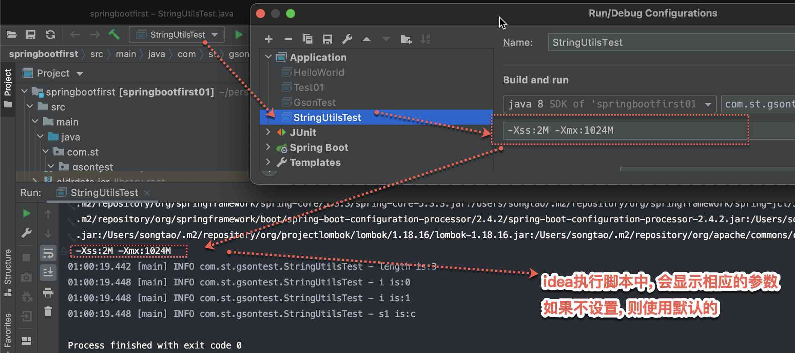

{: id="20210412010650-qr94jcb" updated="20210412010848"}

{: id="20210412010853-apcys8o"}

其中, idea执行脚本, see ((20210411201036-nk3yx38 "{{.text}}"))
{: id="20210412010851-pi4gh3n" updated="20210412010921"}

{: id="20210412010922-i1t6z15"}

{: id="20210412010647-zkenhj5" type="doc"}
