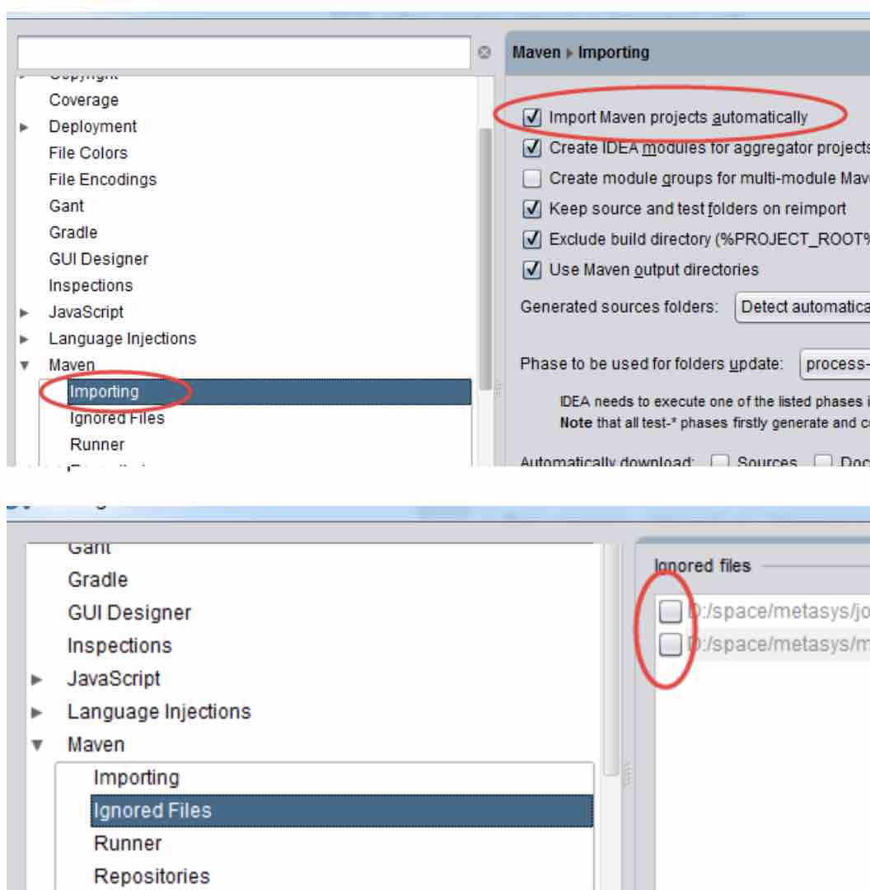

# idea将((20210411234850-qt7gmao "{{.text}}")) 的依赖自动添加到classpath中
{: id="20210412003101-sldxn3p" updated="20210412003148"}

idea会将((20210411234850-qt7gmao "{{.text}}")) 的依赖自动添加到classpath中, 如果没有, 做如下设置:
{: id="20210412003101-98zxxw8" updated="20210412002141"}

`Settings -> Maven -> Importing -> import maven projects automatically` 勾上，自动加载maven依赖 到 classpath.
{: id="20210412003101-6oizllq" updated="20210412002308"}

另外, 注意是, 在idea中设置maven时, 确保((20210411234850-qt7gmao "{{.text}}")) ingored 没有本项目的pom.xml
{: id="20210412003101-d33hcqp" updated="20210412002352"}

{: id="20210412003101-npfhnuq" updated="20210412002525"}

{: id="20210412003116-m4q3et8"}

{: id="20210412003115-4idwdz6" type="doc"}
