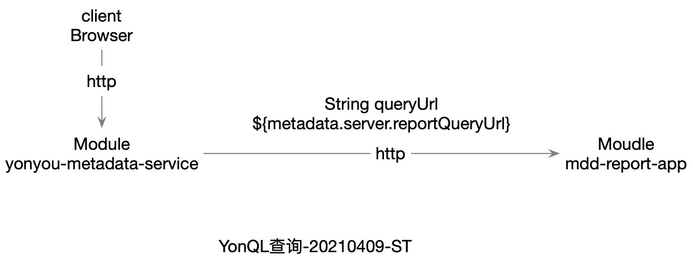
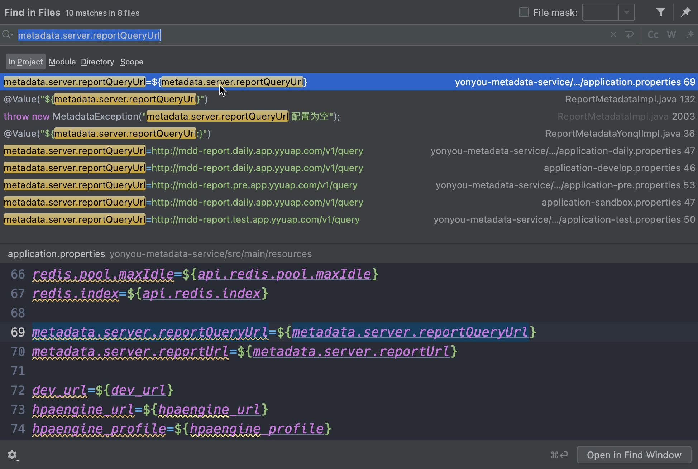

# yytask-20210409-jira-物化
{: id="20210409113159-joa8np6" updated="20210409113252" fold="1"}

# Tags
{: id="20210409113205-ctynu0b" updated="20210409113209"}

#yonyon#
{: id="20210409113210-3bp6vg6" updated="20210409113218" fold="1"}

#yonyontask#
{: id="20210409113218-moi5zuo" updated="20210409113232" fold="1"}

#yytask#
{: id="20210409113233-p0wa6zc" updated="20210409113239"}

# PRD
{: id="20210409100000-uyzef3m" updated="20210409113639"}

- {: id="20210409113037-9zxwrje"}YonQL查询元数据
  {: id="20210409113037-5pqfa65" updated="20210409113043"}
- {: id="20210409113043-kd3j2gc"}物化
  {: id="20210409113043-qnayyzo" updated="20210409113045"}
{: id="20210409113033-eb4mr5c" updated="20210409113037"}

# 基本架构
{: id="20210409100010-tvygukr" updated="20210409113019"}


{: id="20210409100016-4jb07pw" updated="20210409113016"}

# Module, yonyou-metadata-service
{: id="20210409095736-kfs6bqf" updated="20210409100000"}

/Users/songtao/personaldriveMac/Projects/yyprojects/metadataservice/yonyou-metadata/yonyou-metadata-parent/yonyou-metadata-service
{: id="20210409095741-sof8p6x" updated="20210409111359"}

## ReportMetadataYonqlController.java
{: id="20210409111213-ahxoo82" updated="20210409111221"}

/Users/songtao/personaldriveMac/Projects/yyprojects/metadataservice/yonyou-metadata/yonyou-metadata-parent/yonyou-metadata-service/src/main/java/com/yonyou/metadata/service/web/ReportMetadataYonqlController.java
{: id="20210409111213-ijuo3j1" updated="20210409111228"}

## ReportMetadataYonqlService.java
{: id="20210409112012-v8arcoy" updated="20210409112019"}

/Users/songtao/personaldriveMac/Projects/yyprojects/metadataservice/yonyou-metadata/yonyou-metadata-parent/yonyou-metadata-service/src/main/java/com/yonyou/metadata/service/ReportMetadataYonqlService.java
{: id="20210409112012-artzz25" updated="20210409112013"}

## ReportMetadataYonqlImpl.java
{: id="20210409095751-p1mf5hc" updated="20210409095836"}

/Users/songtao/personaldriveMac/Projects/yyprojects/metadataservice/yonyou-metadata/yonyou-metadata-parent/yonyou-metadata-service/src/main/java/com/yonyou/metadata/service/impl/ReportMetadataYonqlImpl.java
{: id="20210409095803-fqr43rr" updated="20210409095823"}

> 参考, 该类中,有yonql方法
> {: id="20210409095842-zmli9wk"}
>
> /Users/songtao/personaldriveMac/Projects/yyprojects/metadataservice/yonyou-metadata/yonyou-metadata-parent/yonyou-metadata-service/src/main/java/com/yonyou/metadata/service/impl/ReportMetadataImpl.java#executeByYonQl
> {: id="20210409095848-zg4260v" updated="20210409095855"}
{: id="20210409095802-iekaifn" updated="20210409095915"}

### 配置等
{: id="20210409111918-6gpeyb1" updated="20210409111942"}

{: id="20210409111943-02v8dkq"}

```java

  @Value("${metadata.server.reportQueryUrl:}")
    private String queryUrl;

    @Value("${metadata.server.reportUrl:}")
    private String reportUrl;
    @Value("${serviceCode}")
    private String serviceCode;
```
{: id="20210409111945-1grp0s6"}


{: id="20210409111945-9jly6gp" updated="20210409112119"}

{: id="20210409111930-hxvmbly"}

# Moudle, mdd-report-app
{: id="20210408213000-hhfss8t" updated="20210409111918"}

/Users/songtao/personaldriveMac/Projects/yyprojects/ucf-mdf-pub-report/mdd-report-app/
{: id="20210408213156-62ix68p" updated="20210408213157"}

## YonqlReportController.java
{: id="20210408213037-nmubv3j" updated="20210408213046"}

/Users/songtao/personaldriveMac/Projects/yyprojects/ucf-mdf-pub-report/mdd-report-app/src/main/java/com/yonyou/ucf/mdf/app/controller/reportform/YonqlReportController.java
{: id="20210408213007-qca03n2" updated="20210408213009"}

## YonqlReportService.java
{: id="20210408213121-vhch6g4" updated="20210408213136"}

/Users/songtao/personaldriveMac/Projects/yyprojects/ucf-mdf-pub-report/mdd-report-app/src/main/java/com/yonyou/ucf/mdf/app/service/YonqlReportService.java
{: id="20210408213121-lkz9jn6" updated="20210408213131"}

## YonqlReportServiceImpl.java
{: id="20210408213047-c5wvxb3" updated="20210408213119"}

/Users/songtao/personaldriveMac/Projects/yyprojects/ucf-mdf-pub-report/mdd-report-app/src/main/java/com/yonyou/ucf/mdf/app/service/impl/YonqlReportServiceImpl.java
{: id="20210408213111-3wbc44s" updated="20210408213112"}

## YonqlReportOldController.java, 废弃
{: id="20210409111325-sikqt8g" updated="20210409111337"}

/Users/songtao/personaldriveMac/Projects/yyprojects/ucf-mdf-pub-report/mdd-report-app/src/main/java/com/yonyou/ucf/mdf/app/controller/reportform/YonqlReportOldController.java
{: id="20210409111323-60yqnmc" updated="20210409111323"}

## YonqlReportServiceOldImpl.java, 废弃
{: id="20210409111255-t5vbs8w" updated="20210409111308"}

/Users/songtao/personaldriveMac/Projects/yyprojects/ucf-mdf-pub-report/mdd-report-app/src/main/java/com/yonyou/ucf/mdf/app/service/impl/YonqlReportServiceOldImpl.java
{: id="20210408213137-xt1rqma" updated="20210409111253"}

{: id="20210409111309-koziu5s"}


{: id="20210408212953-5qhlfx0" type="doc"}
