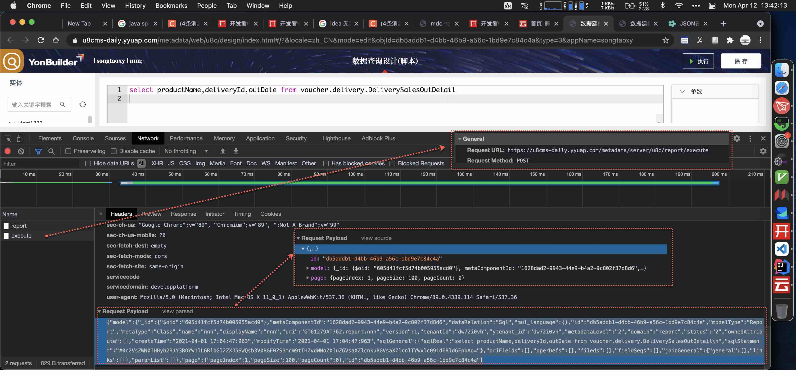
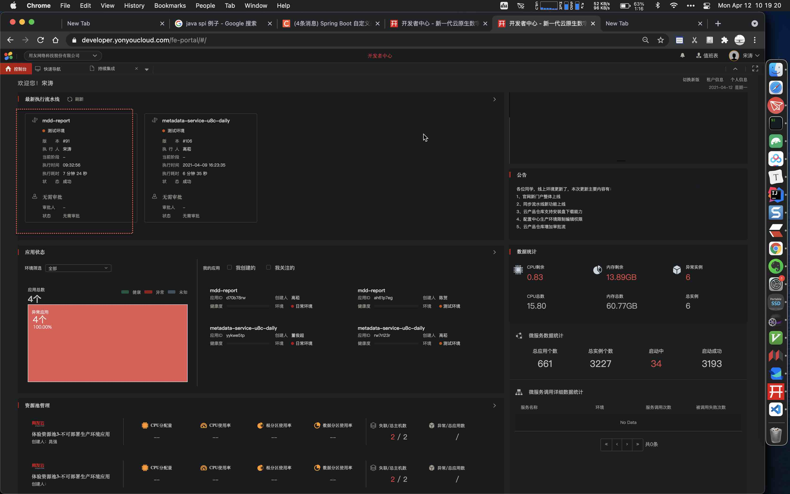
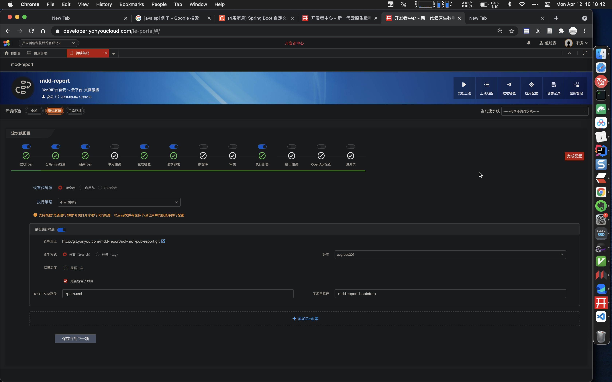
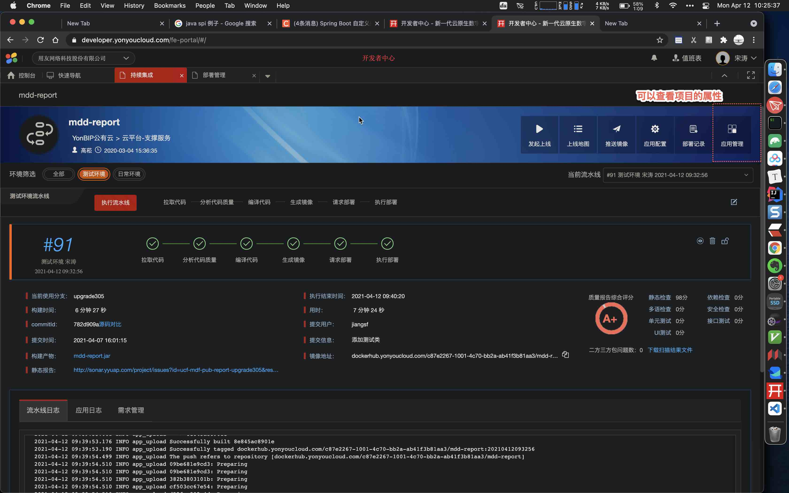
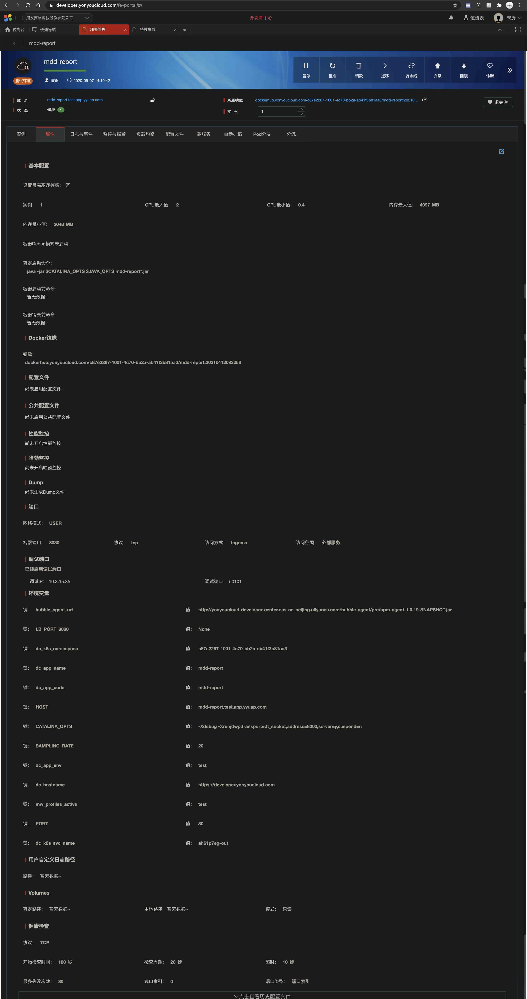
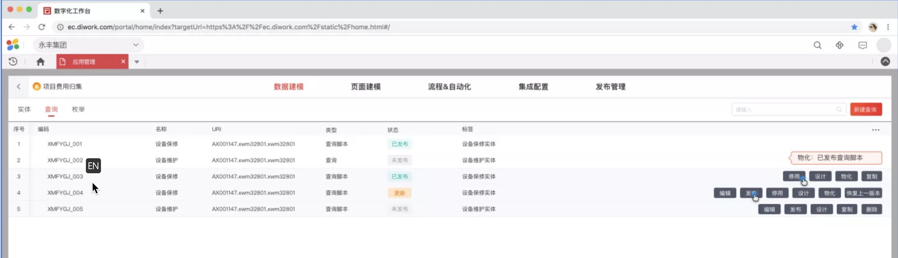
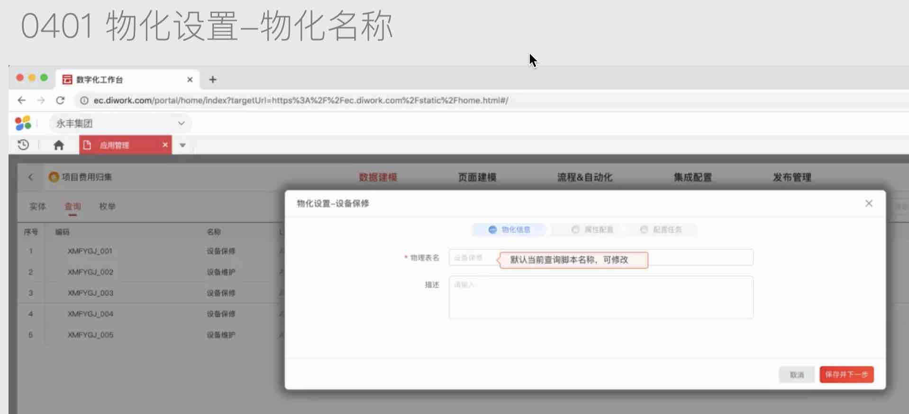
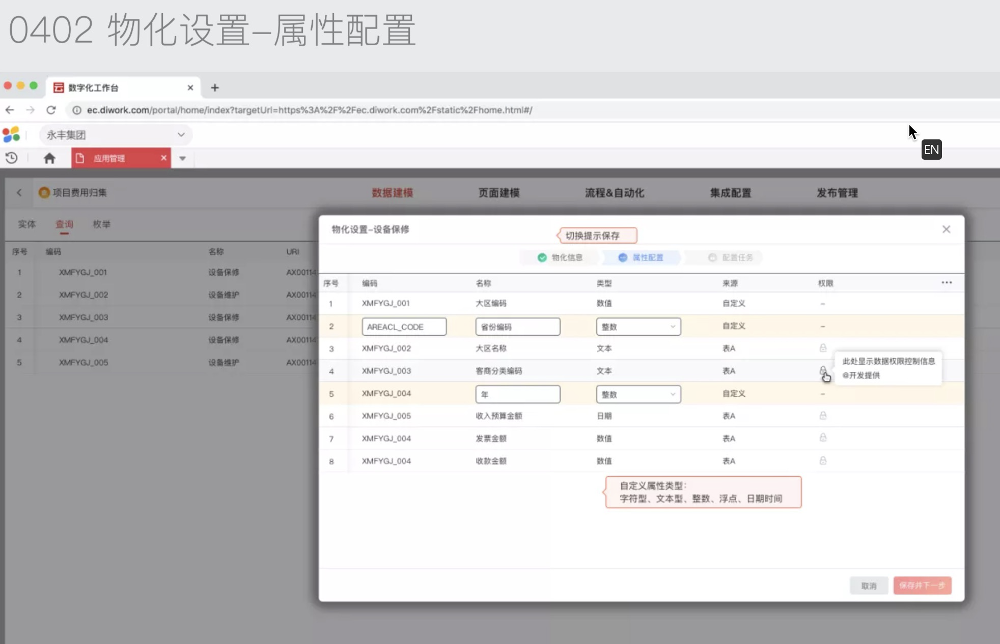
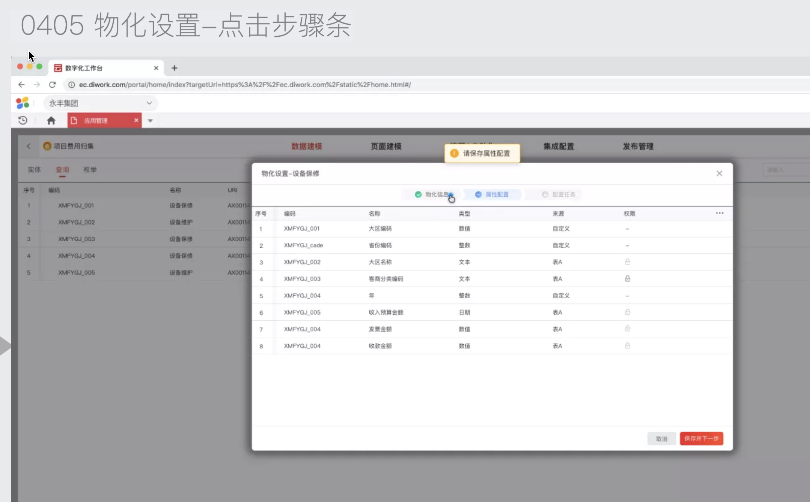
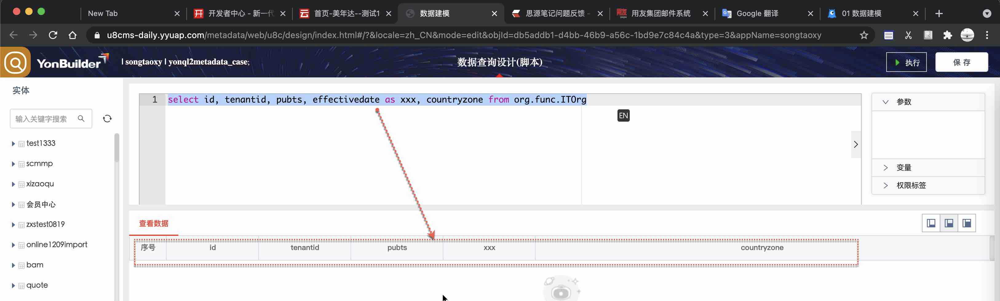

# yytask-20210409-jira-物化
{: id="20210409113159-joa8np6" fold="1" updated="20210409113252"}

# Tags
{: id="20210409113205-ctynu0b" updated="20210409113209"}

#yonyon#
{: id="20210409113210-3bp6vg6" fold="1" updated="20210409113218"}

#yonyontask#
{: id="20210409113218-moi5zuo" fold="1" updated="20210409113232"}

#yytask#
{: id="20210409113233-p0wa6zc" updated="20210409113239"}

# PRD
{: id="20210409100000-uyzef3m" updated="20210409113639"}

- {: id="20210410165446-0bdm8xw"}[ ] YonQL查询元数据  #@todo#
  {: id="20210410165446-2uz298m" updated="20210410165910"}
{: id="20210410163930-9utku94" updated="20210410165446"}

- {: id="20210410163932-gu4ppz2"}[ ] 物化 #@todo# ​
  {: id="20210410163932-2ixjuv1" updated="20210410165459"}
{: id="20210409113043-qnayyzo" updated="20210410163932"}

## 示例uri
{: id="20210412134644-h6xtjjp" updated="20210412134658"}

```
org.func.ITOrg
```
{: id="20210412134658-vnj5gm8" updated="20210412134910"}

## YonQL, Case
{: id="20210409173405-nepbrbb" updated="20210409173422"}

```sql
select bizName,orderId,receiveContacter from voucher.delivery.DeliveryVoucher;

select productName,deliveryId,outDate from voucher.delivery.DeliverySalesOutDetail;

select corderno,producttypes,salesvolume,tax_includedamount from voucher.order.saledetailZoties where  financialyear = 2020;

select name,expenseitemtype,enabled from bd.expenseitem.ExpenseItem;

```
{: id="20210409173422-ctrhwxa" updated="20210409173424"}

## YonQL, 截取
{: id="20210412133851-vr1k9at" updated="20210412133917"}


{: id="20210412134157-4kza4fa" updated="20210412135219"}

```json
{"model":{"_id":{"$oid":"605d41fcf5d74b005955acd0"},"metaComponentId":"1628dad2-9943-44e9-b4a2-9c802f37d8d6","dataRelation":"Sql","mul_language":{},"id":"db5addb1-d4bb-46b9-a56c-1bd9e7c84c4a","modelType":"Report","metaType":"Class","name":"nnn","displayName":"nnn","uri":"GT61279AT762.report.nnn","version":1,"tenantId":"dw72i0vh","ytenant_id":"dw72i0vh","metadataLevel":"2","domain":"report","status":"2","ownedAttribute":[],"createTime":"2021-04-01 17:04:47:963","modifyTime":"2021-04-01 17:04:47:963","sqlGeneral":{"sqlReal":"select productName,deliveryId,outDate from voucher.delivery.DeliverySalesOutDetail\n","sqlStatment":"#0c2VsZWN0IHByb2R1Y3ROYW1lLGRlbGl2ZXJ5SWQsb3V0RGF0ZSBmcm9tIHZvdWNoZXIuZGVsaXZlcnkuRGVsaXZlcnlTYWxlc091dERldGFpbAo="},"oriFields":[],"operDefs":[],"fileds":[],"fieldSeqs":[],"joinGeneral":{"general":[],"links":[]},"paramList":[]},"page":{"pageIndex":1,"pageSize":100,"pageCount":0},"id":"db5addb1-d4bb-46b9-a56c-1bd9e7c84c4a"}
```
{: id="20210412133917-77m60et" updated="20210412133920"}

格式化之后
{: id="20210412134123-47nrrw6" updated="20210412134128"}

```
{
    "model": {
        "_id": {
            "$oid": "605d41fcf5d74b005955acd0"
        },
        "metaComponentId": "1628dad2-9943-44e9-b4a2-9c802f37d8d6",
        "dataRelation": "Sql",
        "mul_language": {},
        "id": "db5addb1-d4bb-46b9-a56c-1bd9e7c84c4a",
        "modelType": "Report",
        "metaType": "Class",
        "name": "nnn",
        "displayName": "nnn",
        "uri": "GT61279AT762.report.nnn",
        "version": 1,
        "tenantId": "dw72i0vh",
        "ytenant_id": "dw72i0vh",
        "metadataLevel": "2",
        "domain": "report",
        "status": "2",
        "ownedAttribute": [],
        "createTime": "2021-04-01 17:04:47:963",
        "modifyTime": "2021-04-01 17:04:47:963",
        "sqlGeneral": {
            "sqlReal": "select productName,deliveryId,outDate from voucher.delivery.DeliverySalesOutDetail\n",
            "sqlStatment": "#0c2VsZWN0IHByb2R1Y3ROYW1lLGRlbGl2ZXJ5SWQsb3V0RGF0ZSBmcm9tIHZvdWNoZXIuZGVsaXZlcnkuRGVsaXZlcnlTYWxlc091dERldGFpbAo="
        },
        "oriFields": [],
        "operDefs": [],
        "fileds": [],
        "fieldSeqs": [],
        "joinGeneral": {
            "general": [],
            "links": []
        },
        "paramList": []
    },
    "page": {
        "pageIndex": 1,
        "pageSize": 100,
        "pageCount": 0
    },
    "id": "db5addb1-d4bb-46b9-a56c-1bd9e7c84c4a"
}
```
{: id="20210412134128-ji14c42" updated="20210412134131"}

# 基本架构
{: id="20210409100010-tvygukr" updated="20210412133855"}


{: id="20210409100016-4jb07pw" updated="20210409113016"}

# Module, yonyou-metadata-service
{: id="20210409095736-kfs6bqf" updated="20210409100000"}

/Users/songtao/personaldriveMac/Projects/yyprojects/metadataservice/yonyou-metadata/yonyou-metadata-parent/yonyou-metadata-service
{: id="20210409095741-sof8p6x" updated="20210413113620"}

## 分支
{: id="20210413113607-lfbvbaa"}

develop
{: id="20210413113607-h3ujcpw"}

## ReportMetadataConcreteController.java
{: id="20210413113607-jws2kro"}

metadataservice/yonyou-metadata/yonyou-metadata-parent/yonyou-metadata-service/src/main/java/com/yonyou/metadata/service/web/ReportMetadataConcreteController.java
{: id="20210413113607-wnwhnxh"}

## ReportMetadataConcreteService.java
{: id="20210413113607-4f9gdnt"}

metadataservice/yonyou-metadata/yonyou-metadata-parent/yonyou-metadata-service/src/main/java/com/yonyou/metadata/service/ReportMetadataConcreteService.java
{: id="20210413113607-0poggy4"}

## ReportMetadataConcreteImpl.java
{: id="20210413113607-tlrhox1"}

metadataservice/yonyou-metadata/yonyou-metadata-parent/yonyou-metadata-service/src/main/java/com/yonyou/metadata/service/impl/ReportMetadataConcreteImpl.java
{: id="20210413113607-pwz710y" updated="20210413113628"}

> 参考, 该类中,有yonql方法
> {: id="20210409095842-zmli9wk"}
>
> /Users/songtao/personaldriveMac/Projects/yyprojects/metadataservice/yonyou-metadata/yonyou-metadata-parent/yonyou-metadata-service/src/main/java/com/yonyou/metadata/service/impl/ReportMetadataImpl.java#executeByYonQl
> {: id="20210409095848-zg4260v" updated="20210409095855"}
{: id="20210409095802-iekaifn" updated="20210409095915"}

### 配置等
{: id="20210409111918-6gpeyb1" updated="20210409173515"}

```java

  @Value("${metadata.server.reportQueryUrl:}")
    private String queryUrl;

    @Value("${metadata.server.reportUrl:}")
    private String reportUrl;
    @Value("${serviceCode}")
    private String serviceCode;
```
{: id="20210409111945-1grp0s6"}


{: id="20210409111945-9jly6gp" updated="20210413113633"}

# Moudle, mdd-report-app
{: id="20210408213000-hhfss8t" updated="20210409111918"}

/Users/songtao/personaldriveMac/Projects/yyprojects/ucf-mdf-pub-report/mdd-report-app/
{: id="20210408213156-62ix68p" updated="20210408213157"}

## 分支
{: id="20210412100129-ivh85sr" updated="20210413113636"}

测试分支: `origin/upgrade305`
{: id="20210412100152-ry50wmg" updated="20210412100620"}

注意, 该部分代码, origin/develop 分支也提交了一部分. 截止日期: 2021.04.11
{: id="20210412100510-j365nbo" updated="20210412100602"}

## 测试环境
{: id="20210412101902-v2a9udk" updated="20210412101908"}

### 简介
{: id="20210412102617-2gausaf" updated="20210412102624"}


{: id="20210412101914-pt55t27" updated="20210412101932"}

相关配置
{: id="20210412101938-inx4dbq" updated="20210412101945"}


{: id="20210412101908-5070pwi" updated="20210412101910"}

### 如何查看配置
{: id="20210412102628-ua45x4d" updated="20210412102633"}


{: id="20210412102633-a876wdn" updated="20210412102641"}

具体配置如下:
{: id="20210412102642-0ht4lo6" updated="20210412102648"}

- {: id="20210412102712-m2ino8p"}是否开启debug模式等
  {: id="20210412102712-s7377ix" updated="20210412102722"}
{: id="20210412102710-qpy7ksh" updated="20210412102712"}


{: id="20210412102648-rnzhth2" updated="20210412102707"}

```
基本配置
设置最高驱逐等级：否
实例：1
CPU最大值：2
CPU最小值：0.4
内存最大值：4097MB
内存最小值：2048MB
容器Debug模式未启动
容器启动命令：
java -jar $CATALINA_OPTS $JAVA_OPTS mdd-report*.jar

容器启动前命令：
暂无数据~

容器销毁前命令：
暂无数据~

Docker镜像
镜像：
dockerhub.yonyoucloud.com/c87e2267-1001-4c70-bb2a-ab41f3b81aa3/mdd-report:20210412093256
配置文件
尚未启用配置文件~

公共配置文件
尚未启用公共配置文件

性能监控
尚未开启性能监控


哈勃监控
尚未开启哈勃监控

Dump
尚未生成Dump文件

端口
网络模式：USER
容器端口：8080
协议：tcp
访问方式：Ingress
访问范围：外部服务
调试端口
已经启用调试端口

调试IP：10.3.15.35调试端口：50101
环境变量
键：hubble_agent_url
值：http://yonyoucloud-developer-center.oss-cn-beijing.aliyuncs.com/hubble-agent/pre/apm-agent-1.0.19-SNAPSHOT.jar
键：LB_PORT_8080
值：None
键：dc_k8s_namespace
值：c87e2267-1001-4c70-bb2a-ab41f3b81aa3
键：dc_app_name
值：mdd-report
键：dc_app_code
值：mdd-report
键：HOST
值：mdd-report.test.app.yyuap.com
键：CATALINA_OPTS
值：-Xdebug -Xrunjdwp:transport=dt_socket,address=8000,server=y,suspend=n
键：SAMPLING_RATE
值：20
键：dc_app_env
值：test
键：dc_hostname
值：https://developer.yonyoucloud.com
键：mw_profiles_active
值：test
键：PORT
值：80
键：dc_k8s_svc_name
值：ah61p7eg-out
用户自定义日志路径
路径：暂无数据~
Volumes
容器路径：暂无数据~
本地路径:暂无数据~
模式：只读
健康检查
协议：TCP
开始检查时间：180秒
检查周期：20秒
超时：10秒
最多失败次数：30
端口索引：0
端口类型：端口索引
```
{: id="20210412102853-b4yt0k3" updated="20210412102854"}

## MetadataReportConcreteController.java
{: id="20210413110615-fkp2ijn" updated="20210413110625"}

/Users/songtao/personaldriveMac/Projects/yyprojects/ucf-mdf-pub-report/mdd-report-app/src/main/java/com/yonyou/ucf/mdf/app/controller/reportform/MetadataReportConcreteController.java
{: id="20210408213037-nmubv3j" updated="20210413110615"}

## MetadataReportConcreteService.java
{: id="20210413110628-bmiyxsw" updated="20210413110651"}

/Users/songtao/personaldriveMac/Projects/yyprojects/ucf-mdf-pub-report/mdd-report-app/src/main/java/com/yonyou/ucf/mdf/app/service/MetadataReportConcreteService.java
{: id="20210413110627-9qurp1y"}

## MetadataReportConcreteImpl.java
{: id="20210413110654-obgc22n" updated="20210413110714"}

/Users/songtao/personaldriveMac/Projects/yyprojects/ucf-mdf-pub-report/mdd-report-app/src/main/java/com/yonyou/ucf/mdf/app/service/impl/MetadataReportConcreteImpl.java
{: id="20210413110654-ldkegxd"}

{: id="20210413110718-52tmui5"}

## ExceptionUtil.java
{: id="20210413110723-r51x3n0"}

/Users/songtao/personaldriveMac/Projects/yyprojects/ucf-mdf-pub-report/mdd-report-app/src/main/java/com/yonyou/ucf/mdf/app/util/ExceptionUtil.java
{: id="20210413110723-k6xawkw"}


{: id="20210413110717-i33q34j"}

```
## YonqlReportController.java
/Users/songtao/personaldriveMac/Projects/yyprojects/ucf-mdf-pub-report/mdd-report-app/src/main/java/com/yonyou/ucf/mdf/app/controller/reportform/YonqlReportController.java
## YonqlReportService.java
/Users/songtao/personaldriveMac/Projects/yyprojects/ucf-mdf-pub-report/mdd-report-app/src/main/java/com/yonyou/ucf/mdf/app/service/YonqlReportService.java
## YonqlReportServiceImpl.java
/Users/songtao/personaldriveMac/Projects/yyprojects/ucf-mdf-pub-report/mdd-report-app/src/main/java/com/yonyou/ucf/mdf/app/service/impl/YonqlReportServiceImpl.java
## YonqlReportOldController.java, 废弃
/Users/songtao/personaldriveMac/Projects/yyprojects/ucf-mdf-pub-report/mdd-report-app/src/main/java/com/yonyou/ucf/mdf/app/controller/reportform/YonqlReportOldController.java
## YonqlReportServiceOldImpl.java, 废弃
/Users/songtao/personaldriveMac/Projects/yyprojects/ucf-mdf-pub-report/mdd-report-app/src/main/java/com/yonyou/ucf/mdf/app/service/impl/YonqlReportServiceOldImpl.java
## ExceptionUtil.java
/Users/songtao/personaldriveMac/Projects/yyprojects/ucf-mdf-pub-report/mdd-report-app/src/main/java/com/yonyou/ucf/mdf/app/util/ExceptionUtil.java
```
{: id="20210409111309-koziu5s" updated="20210412100752"}

{: id="20210413110514-0uo4oyn"}

{: id="20210413110513-0m8e8qk"}

## 代码打包
{: id="20210412101432-1lrv8az" updated="20210412101444"}

[code.zip](assets/code-20210412101602-mmtdg9z.zip)
{: id="20210412101441-d2cue9p" updated="20210412101602"}

## Test Case
{: id="20210412101603-bvti2cf" updated="20210412112312"}

```
httt://mdd-report.test.app.yyuap.com:80/v1/yonql

http://mdd-report.test.app.yyuap.com/mdd-report/v1/yonql

mdd-report.test.app.yyuap.com/v1/yonql
```
{: id="20210412112312-44wg5ep" updated="20210412112314"}

{: id="20210412120415-aj12hpw"}

# Test
{: id="20210412120414-1uyawnj" updated="20210412151141"}

## 对外接口
{: id="20210412151142-xk2i0jx" updated="20210412153107"}

环境: u8c-daily
{: id="20210412152756-dx94qtf" updated="20210412152817"}

path: report/yonqlquery
{: id="20210412152818-3799awd" updated="20210412152835"}

基本参数:
{: id="20210412152839-1ykfs0b" updated="20210412152859"}

```json
{
    "model": {
  
        "metaComponentId": "1628dad2-9943-44e9-b4a2-9c802f37d8d6",
        "dataRelation": "Sql",
  
        "id": "db5addb1-d4bb-46b9-a56c-1bd9e7c84c4a",
        "modelType": "Report",
        "metaType": "Class",
        "name": "nnn",
        "displayName": "nnn",
        "uri": "GT61279AT762.report.nnn",
  
        "tenantId": "dw72i0vh",
        "ytenant_id": "dw72i0vh",
        "metadataLevel": "2",
        "domain": "report",
        "status": "2",
        "ownedAttribute": [],
  
        "sqlGeneral": {
            "sqlReal": "select productName,deliveryId,outDate from voucher.delivery.DeliverySalesOutDetail\n",
            "sqlStatment": "#0c2VsZWN0IHByb2R1Y3ROYW1lLGRlbGl2ZXJ5SWQsb3V0RGF0ZSBmcm9tIHZvdWNoZXIuZGVsaXZlcnkuRGVsaXZlcnlTYWxlc091dERldGFpbAo="
        },
  
    },
    "page": {
        "pageIndex": 1,
        "pageSize": 100,
        "pageCount": 0
    },
    "id": "db5addb1-d4bb-46b9-a56c-1bd9e7c84c4a"
}

```
{: id="20210412151151-n35iwyp" updated="20210412151202"}

## message
{: id="20210412120419-tdxnw4a" updated="20210412120427"}

测试地址:
{: id="20210412120721-skj57sz" updated="20210412120727"}

metadata.server.reportQueryUrl=http://mdd-report.daily.app.yyuap.com/v1/query
{: id="20210412120745-ec5j75f"}

{: id="20210412120721-tbns9it"}

```json
{
"sqlStatment":"select bizName,orderId,receiveContacter from voucher.delivery.DeliveryVoucher;",


}
```
{: id="20210412120427-dsvbxl9" updated="20210412120429"}

{: id="20210412155625-qw0xfgt"}

# 日志分析
{: id="20210412155624-at0ts2q" updated="20210412155630"}

```

```
{: id="20210412155630-e6dbso8" updated="20210412155631"}

```json
yonyou.ucf.mdd.ext.dao.meta.crud.QuerySchemaExecutor] [/v1/query] - select T0.name as `name`,T0.name2 as `name2`,T0.name3 as `name3`,T0.name4 as `name4`,T0.name5 as `name5`,T0.name6 as `name6`
from iuap_cloud_basedoc.org_it T0
where T0.tenantid='dw72i0vh'
 
2021-04-12 16:01:55.816 INFO  [http-nio-8080-exec-5] [com.yonyou.iuap.ucf.sql.translator.interceptor.UcfTranslatorMybatisInterceptor] [/v1/query] - UcfTranslatorMybatisInterceptor -> sql transform to : SELECT T0."name" AS "name", T0.name2 AS "name2", T0.name3 AS "name3", T0.name4 AS "name4", T0.name5 AS "name5", T0.name6 AS "name6" FROM iuap_cloud_basedoc.org_it T0 WHERE T0.tenantid = CAST(? AS character varying) 

2021-04-12 16:01:55.819 DEBUG [http-nio-8080-exec-5] [com.yonyou.ucf.mdd.ext.meta.dao.selectList] [/v1/query] - ==>  Preparing: SELECT T0."name" AS "name", T0.name2 AS "name2", T0.name3 AS "name3", T0.name4 AS "name4", T0.name5 AS "name5", T0.name6 AS "name6" FROM iuap_cloud_basedoc.org_it T0 WHERE T0.tenantid = CAST(? AS character varying) 

2021-04-12 16:01:55.820 DEBUG [http-nio-8080-exec-5] [com.yonyou.ucf.mdd.ext.meta.dao.selectList] [/v1/query] - ==> Parameters: dw72i0vh(String) 


2021-04-12 16:01:55.916 DEBUG [http-nio-8080-exec-5] [com.yonyou.ucf.mdd.ext.meta.dao.selectList] [/v1/query] - <==      Total: 0 
2021-04-12 16:01:55.916 INFO  [http-nio-8080-exec-5] [common.biz.log] [/v1/query] - executeself耗时:148 
2021-04-12 16:01:55.917 INFO  [http-nio-8080-exec-5] [common.biz.log] [/v1/query] - executeself fill耗时:1 
2021-04-12 16:01:55.917 INFO  [http-nio-8080-exec-5] [common.biz.log] [/v1/query] - executeself-handleResultWhenQuery耗时:0 
2021-04-12 16:01:55.917 INFO  [http-nio-8080-exec-5] [com.yonyou.ucf.mdf.app.service.impl.DefaultReportService] [/v1/query] - ========query接口耗时: 154 ======== 
2021-04-12 16:01:55.917 INFO  [http-nio-8080-exec-5] [com.yonyou.ucf.mdf.app.service.impl.DefaultReportService] [/v1/query] - queryForReportTime:154 
line 1:0 no viable alternative at input 'pSpanId'
BR.recoverFromMismatchedToken
/workspace/xssprotect/trunk/grammar/htmlTreeParser.g: node from line 0:0 mismatched tree node: EOF expecting ELEMENT
line 1:0 no viable alternative at input 'X-pspanid'
BR.recoverFromMismatchedToken
/workspace/xssprotect/trunk/grammar/htmlTreeParser.g: node from line 0:0 mismatched tree node: EOF expecting ELEMENT
line 1:0 no viable alternative at input 'sysId'
BR.recoverFromMismatchedToken
/workspace/xssprotect/trunk/grammar/htmlTreeParser.g: node from line 0:0 mismatched tree node: EOF expecting ELEMENT
line 1:0 no viable alternative at input 'X-sysid'
BR.recoverFromMismatchedToken
/workspace/xssprotect/trunk/grammar/htmlTreeParser.g: node from line 0:0 mismatched tree node: EOF expecting ELEMENT
```
{: id="20210412155831-nrl8fb2" updated="20210412160221"}

{: id="20210412164846-nz6bp9l"}

# 重新确定需求
{: id="20210412164845-0a2u8h5" updated="20210412164851"}

## 前端设计稿
{: id="20210412165751-olaw68o" updated="20210412165801"}

设计稿地址：https://lanhuapp.com/url/Y1urn   密码: gkAB
{: id="20210412165801-fg3zgft"}

## 查询
{: id="20210412164955-dmdoz7x" updated="20210412165000"}

1, yonql查询, 执行, 保存, 发布, 存到MongoDB
{: id="20210412164851-4b22kx6" updated="20210412164935"}

点击物化按钮, 弹出"物化"界面
{: id="20210412165049-du06gb0" updated="20210412165105"}

uri: GT61279AT762.report.yonql2metadata_case
{: id="20210412171621-zf6hdfk" updated="20210412171626"}


{: id="20210412164936-3p8dmqt" updated="20210412164953"}

## 物化
{: id="20210412165002-zh23m8w" updated="20210412165119"}


{: id="20210412165008-6wapgfv" updated="20210412165041"}

在物化页面中, 填写信息, 然让"保存并下一步", 会将下面数据传到 后端. 也就是要调用 后端接口
{: id="20210412165230-xhgbr34" updated="20210412165316"}

```
{
tableName: "tableName",
description: "des", 
id:"id"
}
```
{: id="20210412165121-vlkfz9c" updated="20210412165124"}

## 后端接口
{: id="20210412165317-gjvyj5q" updated="20210412165340"}

后端接收数据, 并返回数据
{: id="20210412165340-7x5gt9f" updated="20210412165412"}


{: id="20210412165412-597uv6r" updated="20210412165414"}

前端拿到数据后, 进行编辑, 然后点击: 保存并下一步
{: id="20210412165417-npfx3kq" updated="20210412165545"}


{: id="20210412165433-43ct82e" updated="20210412165524"}

# type
{: id="20210412165559-9hsjre7" updated="20210413114611"}

biztype
{: id="20210413114611-fx1y10l" updated="20210413114618"}

自己选, 查不到
{: id="20210413114619-nr7oep1" updated="20210413114624"}

{: id="20210413114722-e6z5d8p"}

{: id="20210413114727-as5ilxx"}

# 查询, yonql
{: id="20210413114625-35v8ijj" updated="20210413114738"}

yoonql
{: id="20210413114806-ei7cr84" updated="20210413114819"}

```
select id, tenantid, pubts, effectivedate as xxx, countryzone from org.func.ITOrg
```
{: id="20210413114820-rtvoc4a" updated="20210413114821"}


{: id="20210413114846-70q4lzi" updated="20210413114921"}

MongoDB 保存
{: id="20210413114744-eezsa0l" updated="20210413114816"}

```
{ 
    "_id" : ObjectId("605d41fcf5d74b005955acd0"), 
    "metaComponentId" : "1628dad2-9943-44e9-b4a2-9c802f37d8d6", 
    "dataRelation" : "Sql", 
    "mul_language" : {

    }, 
    "id" : "db5addb1-d4bb-46b9-a56c-1bd9e7c84c4a", 
    "modelType" : "Report", 
    "metaType" : "Class", 
    "name" : "yonql2metadata_case", 
    "displayName" : "yonql2metadata_case", 
    "uri" : "GT61279AT762.report.yonql2metadata_case", 
    "version" : NumberInt(2), 
    "tenantId" : "dw72i0vh", 
    "ytenant_id" : "dw72i0vh", 
    "metadataLevel" : "2", 
    "domain" : "report", 
    "status" : "4", 
    "ownedAttribute" : [

    ], 
    "createTime" : ISODate("2021-04-13T03:45:26.993+0000"), 
    "modifyTime" : ISODate("2021-04-13T03:45:26.993+0000"), 
    "sqlGeneral" : {
        "sqlStatment" : "c2VsZWN0IGlkLCB0ZW5hbnRpZCwgcHVidHMsIGVmZmVjdGl2ZWRhdGUgYXMgeHh4LCBjb3VudHJ5em9uZSBmcm9tIG9yZy5mdW5jLklUT3Jn"
    }, 
    "oriFields" : [

    ], 
    "operDefs" : [

    ], 
    "fileds" : [

    ], 
    "fieldSeqs" : [

    ], 
    "joinGeneral" : {
        "general" : [

        ], 
        "links" : [

        ]
    }, 
    "paramList" : [

    ], 
    "description" : "YonQL 查询元数据"
}

```
{: id="20210413114738-up4qvwe" updated="20210413114739"}

{: id="20210413134706-8lm6c5r"}


{: id="20210408212953-5qhlfx0" type="doc"}
