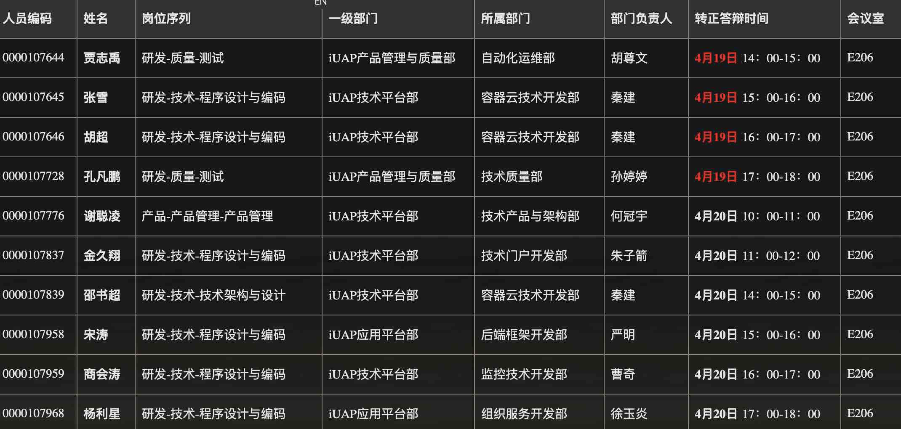

# yytask-转正-20200420
{: id="20210409201206-c8hkixd" updated="20210409201209"}

# 资料
{: id="20210409201210-w9a956q" updated="20210409201227"}

需要的资料, 见 #@BaiduNetdisk#
{: id="20210409201227-4u9hy5g" updated="20210409201259"}

# 说明
{: id="20210409200941-mx1ucap" updated="20210409201206"}

{: id="20210409200940-h5imrvn" updated="20210409201002"}

经部门确认，您可以申请参加4月的转正答辩，请与部门经理沟通好评委人选（至少3名）。具体安排如下
{: id="20210409201003-v2punq2" updated="20210409201028"}

# 流程
{: id="20210409201029-h6sbti6" updated="20210409201033"}

一、个人答辩流程：40分钟/人
{: id="20210409201003-2csxlpq"}

5分钟准备、15分钟PPT呈现、10分钟成果展示、10分钟Q&A
{: id="20210409201003-9jjetgs"}

# 个人准备资料
{: id="20210409201035-dzyu1wj" updated="20210409201044"}

二、个人准备资料：请按照下面要求将提前准备好对应资料，模板见附件
{: id="20210409201003-ygumr23"}

1、答辩PPT一份(包含工作成果) ，答辩现场演示使用，无需发给我；
{: id="20210409201003-xnebv1s"}

2、新员工答辩记录表（请选择自己岗位对应的表且填写好个人基础信息，职级可不填写，答辩前提前把表发给我，表格命名格式：新员工答辩记录表-个人姓名）
{: id="20210409201003-ziego8a"}

3、答辩前切记完成商业行为守则测试并且完成后立即截图提示完成的图，[该截图同上面的2和3一起邮件发 yuelip@yonyou.com](http://127.0.0.1:6806/siyuan/siyuan/TSPR/yy-yonyou/mailto:%E8%AF%A5%E6%88%AA%E5%9B%BE%E5%90%8C%E4%B8%8A%E9%9D%A2%E7%9A%842%E5%92%8C3%E4%B8%80%E8%B5%B7%E9%82%AE%E4%BB%B6%E5%8F%91%20yuelip@yonyou.com)。 路径：手机端友空间-工作台-常用应用-（搜索）商业行为守则
{: id="20210409201003-rm1dd0g"}

4、为了全面增强研发人的数字化转型意识，针对试用期员工读书要求如下：转正前需阅读推荐书籍之一（目前推荐书籍请见附件，滚动更新，以话题中文件为准），并将学习心得在友空间发表（300-500字，更多请以附件形式上传），@#研发人眼中的数字化转型#话题，发布截图需在转正答辩PPT体现或转正次月前发给BP备案。此任务和转正相关，请大家注意及时完成。
{: id="20210409201003-96t56p5"}

5、线上转正审批：转正答辩完成后，您当天自行发起转正申请审批，路径：手机端友空间-常用应用-（搜索）转正，按照要求把必填项填好提交即可。转正审批通过后，会给您发送相应邮件通知
{: id="20210409201003-v7ff3lh"}

# 参加转正名单
{: id="20210409201046-0mz7n0r" updated="20210409201100"}

{: id="20210409201101-6006sbn" updated="20210409201149"}

# 书单
{: id="20210409201129-pqjw0zh" updated="20210409202229"}

- {: id="20210409202309-tg1z6iu"}智能战略.pdf #@BaiduNetdisk# 
  {: id="20210409202309-j24rsnn" updated="20210409202324"}
{: id="20210409202229-rdxpil7" updated="20210409202309"}

- {: id="20210409202307-i5tjzmh"}重构：数字化转型的逻辑-安筱鹏.pdf #@BaiduNetdisk# 
  {: id="20210409202307-4dnhf2b" updated="20210409202330"}
{: id="20210409202255-znpvk4q" updated="20210409202307"}

{: id="20210409202314-ehyopbq"}

{: id="20210409200940-ct7ugl7" type="doc"}
