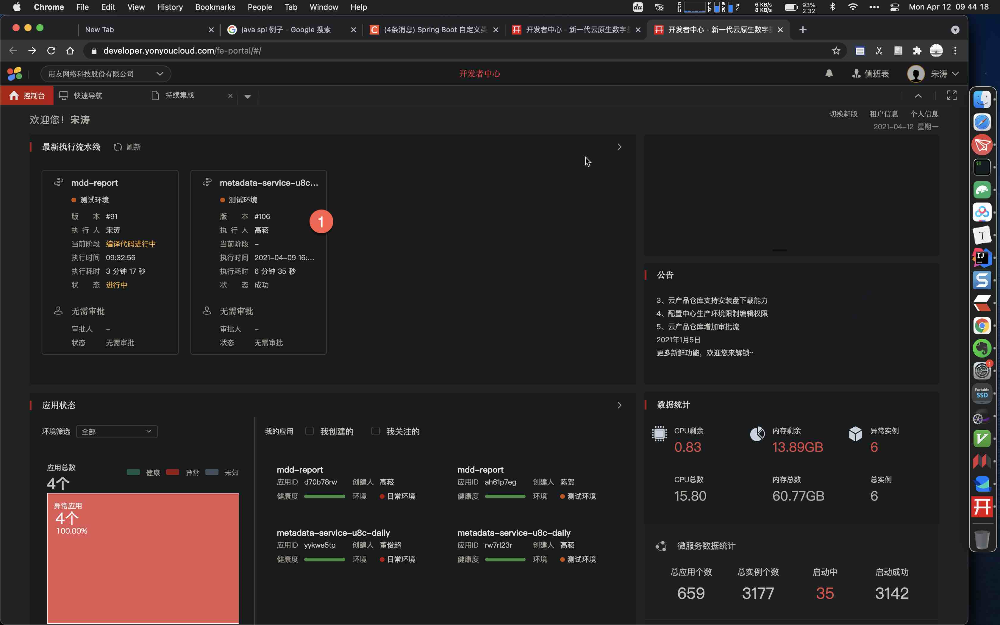

# 登录
{: id="20210412094511-ef3bddo" updated="20210412094521"}

# 找到应用
{: id="20210412094521-rooqeag" updated="20210412094525"}

{: id="20210412094526-rl6il28" updated="20210412094528"}

# 选择环境
{: id="20210412094631-lozoadw" updated="20210412094639"}

{: id="20210412094639-sgk1l0w" updated="20210412094640"}

# 配置, 并保存
{: id="20210412094643-u4j0k8r" updated="20210412094817"}

{: id="20210412094818-b4zl9te" updated="20210412094819"}

# 等待完成, 测试
{: id="20210412094821-zrr8uk9" updated="20210412094926"}

{: id="20210412094927-s6qaj6t"}

{: id="20210412094501-5885pc1" type="doc"}
